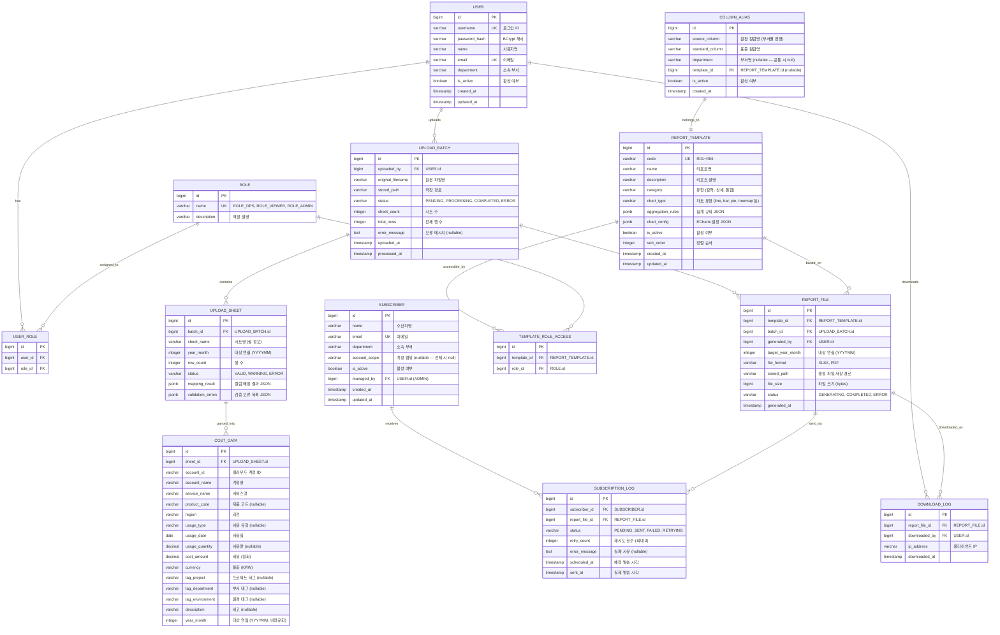

# 데이터 모델 설계 — 클라우드 비용 리포팅 자동화

> **버전**: v1.2 (DQA-001 COST_DATA 엔티티 추가, DQA 회귀 반영)  
> **작성일**: 2026-04-06  
> **작성자**: 01-architect  
> **근거 문서**: docs/brd.md, docs/trd.md, qa/design/design-qa-report.md

---

## 1. ERD (Entity-Relationship Diagram)

---

## 2. 엔티티 상세

### 2.1 USER (사용자)

| 필드 | 타입 | 제약 | 설명 |
|------|------|------|------|
| id | BIGINT | PK, AUTO | 사용자 고유 ID |
| username | VARCHAR(50) | UK, NOT NULL | 로그인 ID |
| password_hash | VARCHAR(255) | NOT NULL | BCrypt 해시 비밀번호 |
| name | VARCHAR(100) | NOT NULL | 사용자 실명 |
| email | VARCHAR(255) | UK, NOT NULL | 이메일 주소 |
| department | VARCHAR(100) | NULL | 소속 부서 |
| is_active | BOOLEAN | DEFAULT true | 활성 여부 |
| created_at | TIMESTAMP | NOT NULL | 생성일시 |
| updated_at | TIMESTAMP | NOT NULL | 수정일시 |

### 2.2 ROLE (역할)

| 필드 | 타입 | 제약 | 설명 |
|------|------|------|------|
| id | BIGINT | PK, AUTO | 역할 고유 ID |
| name | VARCHAR(50) | UK, NOT NULL | 역할명 (ROLE_OPS, ROLE_VIEWER, ROLE_ADMIN) |
| description | VARCHAR(255) | NULL | 역할 설명 |

### 2.3 USER_ROLE (사용자-역할 매핑, M:N)

| 필드 | 타입 | 제약 | 설명 |
|------|------|------|------|
| id | BIGINT | PK, AUTO | 매핑 ID |
| user_id | BIGINT | FK → USER.id, NOT NULL | 사용자 ID |
| role_id | BIGINT | FK → ROLE.id, NOT NULL | 역할 ID |

> UK(user_id, role_id) 복합 유니크

### 2.4 UPLOAD_BATCH (업로드 배치)

| 필드 | 타입 | 제약 | 설명 |
|------|------|------|------|
| id | BIGINT | PK, AUTO | 배치 ID |
| uploaded_by | BIGINT | FK → USER.id, NOT NULL | 업로드 사용자 |
| original_filename | VARCHAR(500) | NOT NULL | 원본 파일명 |
| stored_path | VARCHAR(1000) | NOT NULL | 서버 저장 경로 |
| status | VARCHAR(20) | NOT NULL | PENDING / PROCESSING / COMPLETED / ERROR |
| sheet_count | INTEGER | NULL | 시트 수 |
| total_rows | INTEGER | NULL | 전체 행 수 |
| error_message | TEXT | NULL | 오류 메시지 |
| uploaded_at | TIMESTAMP | NOT NULL | 업로드 일시 |
| processed_at | TIMESTAMP | NULL | 처리 완료 일시 |

### 2.5 UPLOAD_SHEET (업로드 시트)

| 필드 | 타입 | 제약 | 설명 |
|------|------|------|------|
| id | BIGINT | PK, AUTO | 시트 ID |
| batch_id | BIGINT | FK → UPLOAD_BATCH.id, NOT NULL | 소속 배치 |
| sheet_name | VARCHAR(100) | NOT NULL | 시트명 |
| year_month | INTEGER | NOT NULL | 대상 연월 (YYYYMM) |
| row_count | INTEGER | NULL | 행 수 |
| status | VARCHAR(20) | NOT NULL | VALID / WARNING / ERROR |
| mapping_result | JSONB | NULL | 컬럼 매핑 결과 |
| validation_errors | JSONB | NULL | 검증 오류 목록 |

### 2.6 COST_DATA (파싱된 비용 데이터) — DQA-001 신규

> **QA 회귀**: 업로드 후 파싱된 비용 레코드를 구조화 저장하는 핵심 엔티티.
> 리포트 생성(Aggregation Engine), 대시보드 KPI·추이·Top N 집계, ROLE_VIEWER 부서 필터링의 데이터 원천.

| 필드 | 타입 | 제약 | 설명 |
|------|------|------|------|
| id | BIGINT | PK, AUTO | 비용 데이터 ID |
| sheet_id | BIGINT | FK → UPLOAD_SHEET.id, NOT NULL | 원천 시트 |
| account_id | VARCHAR(100) | NOT NULL | 클라우드 계정 ID |
| account_name | VARCHAR(200) | NOT NULL | 계정명 |
| service_name | VARCHAR(200) | NOT NULL | 서비스명 (EC2, S3 등) |
| product_code | VARCHAR(100) | NULL | 제품 코드 |
| region | VARCHAR(100) | NOT NULL | 리전 (ap-northeast-2 등) |
| usage_type | VARCHAR(200) | NULL | 사용 유형 |
| usage_date | DATE | NOT NULL | 사용일 |
| usage_quantity | DECIMAL(15,4) | NULL | 사용량 |
| cost_amount | DECIMAL(15,2) | NOT NULL | 비용 (원화) |
| currency | VARCHAR(3) | NOT NULL, DEFAULT 'KRW' | 통화 |
| tag_project | VARCHAR(200) | NULL | 프로젝트 태그 |
| tag_department | VARCHAR(200) | NULL | 부서 태그 |
| tag_environment | VARCHAR(50) | NULL | 환경 태그 (prod/dev/staging) |
| description | VARCHAR(500) | NULL | 비고 |
| year_month | INTEGER | NOT NULL | 대상 연월 (YYYYMM, 비정규화 — 집계 성능) |

> **관계**: UPLOAD_SHEET → COST_DATA (1:N) — 한 시트에서 200~500행의 비용 레코드 생성
> **용도**: Aggregation Engine이 COST_DATA를 직접 집계 → 대시보드 KPI, 리포트 생성, 부서 필터링 모두 이 테이블 기반

### 2.7 REPORT_TEMPLATE (리포트 템플릿)

| 필드 | 타입 | 제약 | 설명 |
|------|------|------|------|
| id | BIGINT | PK, AUTO | 템플릿 ID |
| code | VARCHAR(10) | UK, NOT NULL | 고유 코드 (R01~R06) |
| name | VARCHAR(200) | NOT NULL | 리포트명 |
| description | TEXT | NULL | 리포트 설명 |
| category | VARCHAR(50) | NOT NULL | 유형 (summary, detail, export) |
| chart_type | VARCHAR(50) | NULL | 차트 유형 |
| aggregation_rules | JSONB | NULL | 집계 규칙 |
| chart_config | JSONB | NULL | ECharts 설정 |
| is_active | BOOLEAN | DEFAULT true | 활성 여부 |
| sort_order | INTEGER | DEFAULT 0 | 정렬 순서 |
| created_at | TIMESTAMP | NOT NULL | 생성일시 |
| updated_at | TIMESTAMP | NOT NULL | 수정일시 |

### 2.7 TEMPLATE_ROLE_ACCESS (템플릿-역할 접근 권한)

| 필드 | 타입 | 제약 | 설명 |
|------|------|------|------|
| id | BIGINT | PK, AUTO | ID |
| template_id | BIGINT | FK → REPORT_TEMPLATE.id, NOT NULL | 템플릿 ID |
| role_id | BIGINT | FK → ROLE.id, NOT NULL | 역할 ID |

### 2.8 REPORT_FILE (생성된 리포트 파일)

| 필드 | 타입 | 제약 | 설명 |
|------|------|------|------|
| id | BIGINT | PK, AUTO | 파일 ID |
| template_id | BIGINT | FK → REPORT_TEMPLATE.id, NOT NULL | 기반 템플릿 |
| batch_id | BIGINT | FK → UPLOAD_BATCH.id, NOT NULL | 원천 배치 |
| generated_by | BIGINT | FK → USER.id, NOT NULL | 생성 사용자 |
| target_year_month | INTEGER | NOT NULL | 대상 연월 (YYYYMM) |
| file_format | VARCHAR(10) | NOT NULL | XLSX / PDF |
| stored_path | VARCHAR(1000) | NOT NULL | 파일 저장 경로 |
| file_size | BIGINT | NULL | 파일 크기 (bytes) |
| status | VARCHAR(20) | NOT NULL | GENERATING / COMPLETED / ERROR |
| generated_at | TIMESTAMP | NOT NULL | 생성 일시 |

### 2.9 SUBSCRIBER (구독자)

| 필드 | 타입 | 제약 | 설명 |
|------|------|------|------|
| id | BIGINT | PK, AUTO | 구독자 ID |
| name | VARCHAR(100) | NOT NULL | 수신자명 |
| email | VARCHAR(255) | UK, NOT NULL | 이메일 |
| department | VARCHAR(100) | NULL | 소속 부서 |
| account_scope | VARCHAR(500) | NULL | 계정 범위 (null=전체) |
| is_active | BOOLEAN | DEFAULT true | 활성 여부 |
| managed_by | BIGINT | FK → USER.id | 관리 담당자 (ADMIN) |
| created_at | TIMESTAMP | NOT NULL | 등록일시 |
| updated_at | TIMESTAMP | NOT NULL | 수정일시 |

### 2.10 SUBSCRIPTION_LOG (구독 발송 이력)

| 필드 | 타입 | 제약 | 설명 |
|------|------|------|------|
| id | BIGINT | PK, AUTO | 로그 ID |
| subscriber_id | BIGINT | FK → SUBSCRIBER.id, NOT NULL | 구독자 |
| report_file_id | BIGINT | FK → REPORT_FILE.id, NOT NULL | 발송 리포트 |
| status | VARCHAR(20) | NOT NULL | PENDING / SENT / FAILED / RETRYING |
| retry_count | INTEGER | DEFAULT 0 | 재시도 횟수 (최대 3) |
| error_message | TEXT | NULL | 실패 사유 |
| scheduled_at | TIMESTAMP | NOT NULL | 예정 발송 시각 |
| sent_at | TIMESTAMP | NULL | 실제 발송 시각 |

### 2.11 DOWNLOAD_LOG (다운로드 이력)

| 필드 | 타입 | 제약 | 설명 |
|------|------|------|------|
| id | BIGINT | PK, AUTO | 로그 ID |
| report_file_id | BIGINT | FK → REPORT_FILE.id, NOT NULL | 대상 리포트 |
| downloaded_by | BIGINT | FK → USER.id, NOT NULL | 다운로드 사용자 |
| ip_address | VARCHAR(45) | NULL | 클라이언트 IP (IPv6 대응) |
| downloaded_at | TIMESTAMP | NOT NULL | 다운로드 일시 |

### 2.12 COLUMN_ALIAS (컬럼 별칭 사전)

| 필드 | 타입 | 제약 | 설명 |
|------|------|------|------|
| id | BIGINT | PK, AUTO | 별칭 ID |
| source_column | VARCHAR(200) | NOT NULL | 원천 컬럼명 (부서별 변형) |
| standard_column | VARCHAR(200) | NOT NULL | 표준 컬럼명 |
| department | VARCHAR(100) | NULL | 부서명 (null=공통) |
| template_id | BIGINT | FK → REPORT_TEMPLATE.id, NULL | 연관 템플릿 (null=전체) |
| is_active | BOOLEAN | DEFAULT true | 활성 여부 |
| created_at | TIMESTAMP | NOT NULL | 등록일시 |

---

## 3. OPEN-002 가정: 표준 데이터 스키마

> ⚠️ **미결 사항**: 표준 스키마는 재무팀·Cloud Ops 확정 전까지 아래를 가정합니다.

### 업로드 엑셀 표준 컬럼 (원천 데이터)

| 표준 컬럼명 | 데이터 타입 | 필수 | 설명 |
|------------|-----------|------|------|
| account_id | VARCHAR | ✅ | 클라우드 계정 ID |
| account_name | VARCHAR | ✅ | 계정명 |
| service_name | VARCHAR | ✅ | 서비스명 (EC2, S3, RDS 등) |
| product_code | VARCHAR | ❌ | 제품 코드 |
| region | VARCHAR | ✅ | 리전 (ap-northeast-2 등) |
| usage_type | VARCHAR | ❌ | 사용 유형 |
| usage_date | DATE | ✅ | 사용일 (YYYY-MM-DD) |
| usage_quantity | DECIMAL | ❌ | 사용량 |
| cost_amount | DECIMAL(15,2) | ✅ | 비용 (원화) |
| currency | VARCHAR(3) | ✅ | 통화 (KRW) |
| tag_project | VARCHAR | ❌ | 프로젝트 태그 |
| tag_department | VARCHAR | ❌ | 부서 태그 |
| tag_environment | VARCHAR | ❌ | 환경 태그 (prod/dev/staging) |
| description | VARCHAR | ❌ | 비고 |

---

## 4. 관계 요약

| 관계 | 유형 | 설명 |
|------|------|------|
| USER ↔ ROLE | M:N | USER_ROLE 중간 테이블 |
| USER → UPLOAD_BATCH | 1:N | 한 사용자가 여러 배치 업로드 |
| UPLOAD_BATCH → UPLOAD_SHEET | 1:N | 한 배치에 최대 12개 시트 |
| **UPLOAD_SHEET → COST_DATA** | **1:N** | **한 시트에서 200~500행 비용 레코드 생성 (DQA-001)** |
| UPLOAD_BATCH → REPORT_FILE | 1:N | 한 배치에서 여러 리포트 생성 |
| REPORT_TEMPLATE → REPORT_FILE | 1:N | 한 템플릿으로 여러 파일 생성 |
| REPORT_TEMPLATE ↔ ROLE | M:N | TEMPLATE_ROLE_ACCESS 중간 테이블 |
| REPORT_FILE → SUBSCRIPTION_LOG | 1:N | 한 파일이 여러 구독자에게 발송 |
| SUBSCRIBER → SUBSCRIPTION_LOG | 1:N | 한 구독자가 여러 발송 이력 |
| REPORT_FILE → DOWNLOAD_LOG | 1:N | 한 파일이 여러 번 다운로드 |
| COLUMN_ALIAS → REPORT_TEMPLATE | N:1 | 여러 별칭이 한 템플릿에 연관 |

---

## 5. 인덱스 권장

| 테이블 | 인덱스 | 용도 |
|--------|--------|------|
| UPLOAD_BATCH | idx_batch_status | 상태별 배치 조회 |
| UPLOAD_BATCH | idx_batch_uploaded_by | 사용자별 배치 조회 |
| **COST_DATA** | **idx_cost_year_month** | **연월 기준 집계 (대시보드, 리포트)** |
| **COST_DATA** | **idx_cost_service** | **서비스별 집계 (Top N, 구성비)** |
| **COST_DATA** | **idx_cost_account_dept** | **계정+부서 기준 필터 (ROLE_VIEWER 부서 필터)** |
| **COST_DATA** | **idx_cost_sheet** | **시트별 비용 데이터 조회** |
| **COST_DATA** | **idx_cost_region** | **리전별 집계** |
| REPORT_FILE | idx_file_template_month | 템플릿+연월 기준 조회 |
| REPORT_FILE | idx_file_status | 생성 상태 필터 |
| SUBSCRIPTION_LOG | idx_sublog_scheduled | 발송 예정 시각 기준 조회 |
| SUBSCRIPTION_LOG | idx_sublog_status | 발송 상태별 조회 |
| DOWNLOAD_LOG | idx_dllog_file | 파일별 다운로드 이력 |
| COLUMN_ALIAS | idx_alias_source | 원천 컬럼명 검색 |

---

*본 문서는 BRD v1.1, TRD v1.1, QA 회귀(DQA-001~009) 기반으로 작성되었습니다. OPEN-002(표준 스키마) 확정 시 §3 및 COST_DATA 컬럼 업데이트 필요.*
