# 데이터 모델 설계 — 클라우드 비용 리포팅 자동화

> **버전**: v3.0 (DQA-v2-001~015 회귀 반영)
> **작성일**: 2026-04-15
> **작성자**: 01-architect
> **근거 문서**: docs/brd.md, docs/trd.md, qa/design/design-qa-report.md v3.0, OPEN-009~017

---

## 0. v3.0 변경 요약 (DQA-v2-001~015 반영)

| DQA ID | 해소 내용 |
|--------|-----------|
| **DQA-v2-001** Critical | §2.4/§2.5/§2.8/§2.9/§2.10/§2.11/§2.12 엔티티 상세 표에 `tenant_id CHAR(10)` 컬럼 실제 추가 + UK 재설계 완료 |
| **DQA-v2-004** High | TEMPLATE_ROLE_ACCESS 엔티티·관계·필드 **전면 삭제** — 템플릿 가시성은 코드 상수 `RoleTemplateMatrix`로 처리 |
| **DQA-v2-005, v2-009** High | REPORT_FILE §2.7에서 `batch_id` 삭제, `tenant_id`/`contract_id` 추가 — COST_DATA 기반 집계 흐름과 일관 |
| **DQA-v2-008** Major | §6.3에 CLOUD_ACCOUNT / CLOUD_SUB_ACCOUNT / CUR_SOURCE의 **JOIN-기반 RLS 정책 SQL** 명문화 |
| **DQA-v2-011 (v1 DQA-011~013)** Minor | §2.x 섹션 번호 중복 해소 (§2.7 TEMPLATE_ROLE_ACCESS 삭제로 자연 정리) |

### v1.2 → v2.0 → v3.0 누적 변경

| 항목 | 상태 |
|------|------|
| 엔티티 수 | 12 → 20 → **19** (TEMPLATE_ROLE_ACCESS 폐기) |
| 신규 엔티티 (v2.0) | TENANT, CONTRACT, CLOUD_ACCOUNT, CLOUD_SUB_ACCOUNT, CUR_SOURCE, TENANT_USER_SCOPE, APPROVAL_REQUEST, AUDIT_LOG |
| 역할 | ROLE_OPS/VIEWER/ADMIN (3) → SYS_ADMIN/SYS_OPS/TENANT_ADMIN/TENANT_APPROVER/TENANT_USER (5) |
| 데이터 격리 | PostgreSQL RLS (모든 테넌트 데이터 테이블 tenant_id + 정책) |
| 식별자 | Tenant.id 10자리 자동생성, Tenant.slug 영문 자동생성·수정 가능 |
| COST_DATA 귀속 | `tenant_id`, `contract_id`, `sub_account_id` 3종 추가 |
| 폐기 | **TEMPLATE_ROLE_ACCESS 완전 제거** — 역할-템플릿 매트릭스는 애플리케이션 상수 |

---

## 1. ERD (Entity-Relationship Diagram)

```mermaid
erDiagram
    TENANT ||--o{ CONTRACT : "owns"
    TENANT ||--o{ USER : "scopes"
    TENANT ||--o{ AUDIT_LOG : "isolated_in"
    CONTRACT ||--o{ CLOUD_ACCOUNT : "groups"
    CLOUD_ACCOUNT ||--o{ CLOUD_SUB_ACCOUNT : "contains"
    CLOUD_ACCOUNT ||--o{ CUR_SOURCE : "ingest_via"
    CLOUD_SUB_ACCOUNT ||--o{ COST_DATA : "billed_for"

    USER ||--o{ USER_ROLE : "has"
    ROLE ||--o{ USER_ROLE : "assigned_to"
    USER ||--o{ TENANT_USER_SCOPE : "scoped_to"
    CLOUD_SUB_ACCOUNT ||--o{ TENANT_USER_SCOPE : "grants_view"
    USER ||--o{ APPROVAL_REQUEST : "requests"
    USER ||--o{ APPROVAL_REQUEST : "approves"
    USER ||--o{ AUDIT_LOG : "performs"

    USER ||--o{ UPLOAD_BATCH : "uploads"
    USER ||--o{ DOWNLOAD_LOG : "downloads"

    UPLOAD_BATCH ||--o{ UPLOAD_SHEET : "contains"
    UPLOAD_SHEET ||--o{ COST_DATA : "parsed_into"

    REPORT_TEMPLATE ||--o{ REPORT_FILE : "based_on"
    SUBSCRIBER ||--o{ SUBSCRIPTION_LOG : "receives"
    REPORT_FILE ||--o{ SUBSCRIPTION_LOG : "sent_via"
    REPORT_FILE ||--o{ DOWNLOAD_LOG : "downloaded_as"
    CONTRACT ||--o{ REPORT_FILE : "scoped_to"

    COLUMN_ALIAS ||--|| REPORT_TEMPLATE : "belongs_to"

    TENANT {
        char id PK "10자리 자동생성 (Y1+M1+SEQ6+CHK2)"
        varchar slug UK "영문 슬러그 (자동생성·수정가능)"
        varchar customer_name "고객명"
        varchar customer_type "법인/개인/내부조직/그룹사"
        varchar biz_reg_no "사업자등록번호"
        varchar corp_reg_no "법인등록번호 (nullable)"
        varchar ceo_name "대표자명"
        varchar industry "업종/업태"
        varchar status "활성/휴면/해지/정지"
        date joined_at "가입일"
        date terminated_at "해지일 (nullable)"
        varchar admin_name "테넌트관리자 이름"
        varchar admin_dept "테넌트관리자 부서"
        varchar admin_title "테넌트관리자 직책"
        varchar admin_phone "테넌트관리자 전화번호"
        varchar admin_email "테넌트관리자 이메일"
        timestamp created_at
        timestamp updated_at
    }

    CONTRACT {
        bigint id PK
        char tenant_id FK "TENANT.id"
        varchar code UK "계약ID (사용자노출용)"
        varchar name "계약명"
        date start_date
        date end_date
        varchar status "DRAFT/ACTIVE/EXPIRED/TERMINATED"
        varchar contract_type "DIRECT/AGENCY/MSP/RESELLING/INTERNAL"
        varchar currency "KRW/USD"
        varchar billing_cycle "MONTHLY/QUARTERLY/HALF/ANNUAL"
        varchar tax_mode "INCLUDED/EXCLUDED/EXEMPT"
        varchar payment_term "POST/PRE/MONTH_END"
        integer issue_day "청구서 발행 기준일 (1~31)"
        integer due_days "납부기한 (일)"
        text penalty_discount_credit "위약금/할인/크레딧 조건"
        boolean sla_linked "SLA 연계 여부"
        timestamp created_at
        timestamp updated_at
    }

    CLOUD_ACCOUNT {
        bigint id PK
        bigint contract_id FK "CONTRACT.id"
        varchar provider "AWS (MVP), 향후 AZURE/GCP"
        varchar payer_account_id "AWS Payer / 향후 Azure Billing Account / GCP Billing Account"
        varchar name "관리용 명칭"
        date effective_from "계약 귀속 시작일"
        date effective_to "계약 귀속 종료일 (nullable)"
        timestamp created_at
        timestamp updated_at
    }

    CLOUD_SUB_ACCOUNT {
        bigint id PK
        bigint cloud_account_id FK "CLOUD_ACCOUNT.id"
        varchar sub_account_id "AWS Linked Account / Azure Subscription / GCP Project"
        varchar name "관리용 명칭"
        boolean is_active
        timestamp created_at
    }

    CUR_SOURCE {
        bigint id PK
        bigint cloud_account_id FK "CLOUD_ACCOUNT.id"
        varchar source_type "MANUAL_UPLOAD (MVP), 향후 AWS_S3_PULL"
        jsonb config "S3 버킷·prefix·역할ARN 등 (향후)"
        boolean is_active
        timestamp created_at
        timestamp updated_at
    }

    TENANT_USER_SCOPE {
        bigint id PK
        char tenant_id FK "TENANT.id"
        bigint user_id FK "USER.id"
        bigint sub_account_id FK "CLOUD_SUB_ACCOUNT.id"
        boolean can_view
        boolean can_subscribe
        boolean can_approve
        timestamp created_at
    }

    APPROVAL_REQUEST {
        bigint id PK
        char tenant_id FK "TENANT.id"
        bigint requester_id FK "USER.id"
        bigint approver_id FK "USER.id (nullable)"
        varchar request_type "TICKET 등 (향후 확장)"
        jsonb payload "요청 내용 JSON"
        varchar status "PENDING/APPROVED/REJECTED/CANCELED"
        text reject_reason
        timestamp created_at
        timestamp decided_at
    }

    AUDIT_LOG {
        bigint id PK
        char tenant_id FK "TENANT.id (nullable — 시스템 작업)"
        bigint actor_id FK "USER.id"
        varchar action "LOGIN/UPLOAD/GENERATE/DOWNLOAD/USER_CREATE 등"
        varchar target_type "엔티티명"
        varchar target_id "대상 ID"
        varchar ip_address
        jsonb detail
        timestamp created_at
    }

    COST_DATA {
        bigint id PK
        char tenant_id FK "TENANT.id (RLS)"
        bigint contract_id FK "CONTRACT.id (귀속 계약)"
        bigint sub_account_id FK "CLOUD_SUB_ACCOUNT.id"
        bigint sheet_id FK "UPLOAD_SHEET.id"
        varchar account_id "클라우드 계정 ID"
        varchar account_name "계정명"
        varchar service_name "서비스명"
        varchar product_code "제품 코드 (nullable)"
        varchar region "리전"
        varchar usage_type "사용 유형 (nullable)"
        date usage_date "사용일"
        decimal usage_quantity "사용량 (nullable)"
        decimal cost_amount "비용 (원화)"
        varchar currency "통화 (KRW)"
        varchar tag_project "프로젝트 태그 (nullable)"
        varchar tag_department "부서 태그 (nullable)"
        varchar tag_environment "환경 태그 (nullable)"
        varchar description "비고 (nullable)"
        integer year_month "대상 연월 (YYYYMM, 비정규화)"
    }

    USER {
        bigint id PK
        char tenant_id FK "TENANT.id (nullable — SYS_* 사용자는 null)"
        varchar username "로그인 ID (테넌트 내 unique)"
        varchar password_hash "BCrypt 해시"
        varchar name "사용자명"
        varchar email "이메일"
        varchar department "소속 부서 (테넌트 사용자)"
        varchar title "직책 (nullable)"
        varchar phone "전화번호 (nullable)"
        varchar auth_provider "LOCAL (MVP), 향후 SSO"
        boolean is_active
        timestamp last_login_at
        timestamp created_at
        timestamp updated_at
    }

    ROLE {
        bigint id PK
        varchar name UK "ROLE_SYS_ADMIN, ROLE_SYS_OPS, ROLE_TENANT_ADMIN, ROLE_TENANT_APPROVER, ROLE_TENANT_USER"
        varchar scope "GLOBAL / TENANT"
        varchar description
    }

    USER_ROLE {
        bigint id PK
        bigint user_id FK
        bigint role_id FK
    }

    UPLOAD_BATCH {
        bigint id PK
        char tenant_id FK "TENANT.id (nullable — SYS_OPS 전역업로드)"
        bigint cloud_account_id FK "CLOUD_ACCOUNT.id (Payer 단위 업로드)"
        bigint uploaded_by FK "USER.id"
        varchar original_filename "원본 파일명"
        varchar stored_path "저장 경로"
        varchar status "PENDING, PROCESSING, COMPLETED, ERROR"
        integer sheet_count "시트 수"
        integer total_rows "전체 행 수"
        text error_message "오류 메시지 (nullable)"
        timestamp uploaded_at
        timestamp processed_at
    }

    UPLOAD_SHEET {
        bigint id PK
        bigint batch_id FK "UPLOAD_BATCH.id"
        varchar sheet_name "시트명 (월 정보)"
        integer year_month "대상 연월 (YYYYMM)"
        integer row_count "행 수"
        varchar status "VALID, WARNING, ERROR"
        jsonb mapping_result "컬럼 매핑 결과 JSON"
        jsonb validation_errors "검증 오류 목록 JSON"
    }

    REPORT_TEMPLATE {
        bigint id PK
        varchar code UK "R01~R06"
        varchar name "리포트명"
        varchar description "리포트 설명"
        varchar category "유형 (요약, 상세, 통합)"
        varchar chart_type "차트 유형 (line, bar, pie, treemap 등)"
        jsonb aggregation_rules "집계 규칙 JSON"
        jsonb chart_config "ECharts 설정 JSON"
        boolean is_active "활성 여부"
        integer sort_order "정렬 순서"
        timestamp created_at
        timestamp updated_at
    }

    REPORT_FILE {
        bigint id PK
        char tenant_id FK "TENANT.id (RLS)"
        bigint contract_id FK "CONTRACT.id (귀속 계약)"
        bigint template_id FK "REPORT_TEMPLATE.id"
        bigint generated_by FK "USER.id"
        integer target_year_month "대상 연월 (YYYYMM)"
        varchar file_format "XLSX, PDF"
        varchar stored_path "생성 파일 저장 경로"
        bigint file_size "파일 크기 (bytes)"
        varchar status "GENERATING, COMPLETED, ERROR"
        timestamp generated_at
    }

    SUBSCRIBER {
        bigint id PK
        char tenant_id FK "TENANT.id (RLS)"
        bigint contract_id FK "CONTRACT.id (구독 대상 계약)"
        varchar name "수신자명"
        varchar email UK "이메일"
        varchar department "소속 부서"
        varchar account_scope "계정 범위 (nullable — 전체 시 null)"
        boolean is_active "활성 여부"
        bigint managed_by FK "USER.id (ADMIN)"
        timestamp created_at
        timestamp updated_at
    }

    SUBSCRIPTION_LOG {
        bigint id PK
        bigint subscriber_id FK "SUBSCRIBER.id"
        bigint report_file_id FK "REPORT_FILE.id"
        varchar status "PENDING, SENT, FAILED, RETRYING"
        integer retry_count "재시도 횟수 (최대 3)"
        text error_message "실패 사유 (nullable)"
        timestamp scheduled_at "예정 발송 시각"
        timestamp sent_at "실제 발송 시각"
    }

    DOWNLOAD_LOG {
        bigint id PK
        bigint report_file_id FK "REPORT_FILE.id"
        bigint downloaded_by FK "USER.id"
        varchar ip_address "클라이언트 IP"
        timestamp downloaded_at
    }

    COLUMN_ALIAS {
        bigint id PK
        varchar source_column "원천 컬럼명 (부서별 변형)"
        varchar standard_column "표준 컬럼명"
        varchar department "부서명 (nullable — 공통 시 null)"
        bigint template_id FK "REPORT_TEMPLATE.id (nullable)"
        boolean is_active "활성 여부"
        timestamp created_at
    }
```



---

## 2. 엔티티 상세

> **v2.0 공통 변경**: 모든 테넌트 데이터 테이블(`USER`, `UPLOAD_BATCH`, `UPLOAD_SHEET`, `COST_DATA`, `REPORT_FILE`, `SUBSCRIBER`, `SUBSCRIPTION_LOG`, `DOWNLOAD_LOG`, `COLUMN_ALIAS`, `APPROVAL_REQUEST`, `AUDIT_LOG`)에 `tenant_id CHAR(10)` 컬럼 추가. PostgreSQL RLS 정책으로 자동 격리(§6 참조).

### 2.0-A TENANT (테넌트 = 고객)

| 필드 | 타입 | 제약 | 설명 |
|------|------|------|------|
| id | CHAR(10) | PK | 10자리 자동생성 (Y1+M1+SEQ6+CHK2) |
| slug | VARCHAR(64) | UK, NOT NULL | 영문 슬러그 (등록 시 자동생성, 수정 가능) |
| customer_name | VARCHAR(200) | NOT NULL | 고객명 |
| customer_type | VARCHAR(20) | NOT NULL | CORP / PERSONAL / INTERNAL / GROUP |
| biz_reg_no | VARCHAR(20) | NULL | 사업자등록번호 |
| corp_reg_no | VARCHAR(20) | NULL | 법인등록번호 |
| ceo_name | VARCHAR(100) | NULL | 대표자명 |
| industry | VARCHAR(200) | NULL | 업종/업태 |
| status | VARCHAR(20) | NOT NULL | ACTIVE / DORMANT / TERMINATED / SUSPENDED |
| joined_at | DATE | NOT NULL | 가입일 |
| terminated_at | DATE | NULL | 해지일 |
| admin_name / admin_dept / admin_title / admin_phone / admin_email | VARCHAR | NOT NULL | 테넌트 대표 관리자 연락처 (실제 사용자 계정과 별개 — 비상연락) |
| created_at, updated_at | TIMESTAMP | NOT NULL | |

> **Slug 자동생성 규칙**: `customer_name` → 영문 음역(불가 시 `tenant`) → kebab-case → 32자 절단 → 충돌 시 `-2`, `-3` 접미. UI에서 즉시 수정 가능, 저장 시 `[a-z0-9-]+` 패턴·중복 검증.
> **ID 자동생성**: 가입일 연(2026=`A`)·월(`A`~`L`) base32 1자씩 + 6자리 시퀀스 base32 + 2자리 Damm 체크디짓.

### 2.0-B CONTRACT (계약)

| 필드 | 타입 | 제약 | 설명 |
|------|------|------|------|
| id | BIGINT | PK, AUTO | |
| tenant_id | CHAR(10) | FK → TENANT.id, NOT NULL | RLS |
| code | VARCHAR(50) | UK, NOT NULL | 계약 ID (사용자 노출, 예: `SHC-2026-001`) |
| name | VARCHAR(200) | NOT NULL | 계약명 |
| start_date / end_date | DATE | NOT NULL / NULL | 계약 시작·종료일 |
| status | VARCHAR(20) | NOT NULL | DRAFT / ACTIVE / EXPIRED / TERMINATED |
| contract_type | VARCHAR(20) | NOT NULL | DIRECT / AGENCY / MSP / RESELLING / INTERNAL |
| currency | VARCHAR(3) | NOT NULL | KRW / USD |
| billing_cycle | VARCHAR(20) | NOT NULL | MONTHLY / QUARTERLY / HALF / ANNUAL |
| tax_mode | VARCHAR(20) | NOT NULL | INCLUDED / EXCLUDED / EXEMPT |
| payment_term | VARCHAR(20) | NOT NULL | POST / PRE / MONTH_END |
| issue_day | INTEGER | NOT NULL | 청구서 발행 기준일 (1~31) |
| due_days | INTEGER | NOT NULL | 납부기한 (일수) |
| penalty_discount_credit | TEXT | NULL | 위약금/할인/크레딧 조건 |
| sla_linked | BOOLEAN | NOT NULL DEFAULT false | SLA 연계 여부 |
| created_at, updated_at | TIMESTAMP | NOT NULL | |

### 2.0-C CLOUD_ACCOUNT (페이어 어카운트)

| 필드 | 타입 | 제약 | 설명 |
|------|------|------|------|
| id | BIGINT | PK, AUTO | |
| contract_id | BIGINT | FK → CONTRACT.id, NOT NULL | |
| provider | VARCHAR(10) | NOT NULL | AWS (MVP), 향후 AZURE / GCP |
| payer_account_id | VARCHAR(100) | NOT NULL | AWS Payer ID / 향후 Azure Billing Account / GCP Billing Account |
| name | VARCHAR(200) | NOT NULL | 관리용 명칭 |
| effective_from / effective_to | DATE | NOT NULL / NULL | 계약 귀속 기간 (Payer 이전 처리) |
| created_at, updated_at | TIMESTAMP | NOT NULL | |

> **UK**: (provider, payer_account_id, effective_from)
> **시간 경계**: 같은 Payer가 다른 계약으로 이전 시 새 행으로 추가, 이전 행은 `effective_to` 설정.

### 2.0-D CLOUD_SUB_ACCOUNT (링크드 어카운트 / 서브 계정)

| 필드 | 타입 | 제약 | 설명 |
|------|------|------|------|
| id | BIGINT | PK, AUTO | |
| cloud_account_id | BIGINT | FK → CLOUD_ACCOUNT.id, NOT NULL | |
| sub_account_id | VARCHAR(100) | NOT NULL | AWS Linked Account / Azure Subscription / GCP Project |
| name | VARCHAR(200) | NOT NULL | |
| is_active | BOOLEAN | DEFAULT true | |
| created_at | TIMESTAMP | NOT NULL | |

> **UK**: (cloud_account_id, sub_account_id)

### 2.0-E CUR_SOURCE (CUR 수집 소스)

| 필드 | 타입 | 제약 | 설명 |
|------|------|------|------|
| id | BIGINT | PK, AUTO | |
| cloud_account_id | BIGINT | FK → CLOUD_ACCOUNT.id, NOT NULL | |
| source_type | VARCHAR(20) | NOT NULL | MANUAL_UPLOAD (MVP) / AWS_S3_PULL (향후) |
| config | JSONB | NULL | 향후 S3 버킷·prefix·역할ARN |
| is_active | BOOLEAN | DEFAULT true | |
| created_at, updated_at | TIMESTAMP | NOT NULL | |

### 2.0-F TENANT_USER_SCOPE (테넌트 이용자 권한 = 서브계정 단위)

| 필드 | 타입 | 제약 | 설명 |
|------|------|------|------|
| id | BIGINT | PK, AUTO | |
| tenant_id | CHAR(10) | FK → TENANT.id, NOT NULL | RLS |
| user_id | BIGINT | FK → USER.id, NOT NULL | |
| sub_account_id | BIGINT | FK → CLOUD_SUB_ACCOUNT.id, NOT NULL | |
| can_view | BOOLEAN | DEFAULT true | 조회 권한 |
| can_subscribe | BOOLEAN | DEFAULT false | 구독 등록 권한 |
| can_approve | BOOLEAN | DEFAULT false | 승인 권한 (TENANT_APPROVER용) |
| created_at | TIMESTAMP | NOT NULL | |

> **UK**: (user_id, sub_account_id)
> **상위 권한 자동 계산**: 한 계약(Contract)의 모든 SubAccount에 권한이 있으면 "계약 전체 권한"으로 간주.

### 2.0-G APPROVAL_REQUEST (승인 요청 — placeholder)

| 필드 | 타입 | 제약 | 설명 |
|------|------|------|------|
| id | BIGINT | PK, AUTO | |
| tenant_id | CHAR(10) | FK → TENANT.id, NOT NULL | RLS |
| requester_id | BIGINT | FK → USER.id, NOT NULL | |
| approver_id | BIGINT | FK → USER.id, NULL | |
| request_type | VARCHAR(50) | NOT NULL | TICKET 등 (향후 확장) |
| payload | JSONB | NOT NULL | 요청 내용 |
| status | VARCHAR(20) | NOT NULL | PENDING / APPROVED / REJECTED / CANCELED |
| reject_reason | TEXT | NULL | |
| created_at | TIMESTAMP | NOT NULL | |
| decided_at | TIMESTAMP | NULL | |

> **MVP 범위**: 스키마와 빈 화면(승인함)만 제공. 실제 승인 흐름은 향후 티켓 시스템 연계 시 구현.

### 2.0-H AUDIT_LOG (감사 로그)

| 필드 | 타입 | 제약 | 설명 |
|------|------|------|------|
| id | BIGINT | PK, AUTO | |
| tenant_id | CHAR(10) | FK → TENANT.id, NULL | RLS (시스템 작업은 NULL) |
| actor_id | BIGINT | FK → USER.id, NOT NULL | 행위 사용자 |
| action | VARCHAR(50) | NOT NULL | LOGIN / UPLOAD / GENERATE_REPORT / DOWNLOAD / USER_CREATE / CONTRACT_UPDATE 등 |
| target_type | VARCHAR(50) | NULL | 엔티티명 |
| target_id | VARCHAR(100) | NULL | 대상 ID |
| ip_address | VARCHAR(45) | NULL | |
| detail | JSONB | NULL | 변경 전후 값 등 |
| created_at | TIMESTAMP | NOT NULL | |

> **인덱스**: (tenant_id, created_at DESC), (actor_id, created_at DESC), (action, created_at DESC)

### 2.1 USER (사용자) — v2.0 변경

| 필드 | 타입 | 제약 | 설명 |
|------|------|------|------|
| id | BIGINT | PK, AUTO | |
| **tenant_id** | CHAR(10) | FK → TENANT.id, **NULL** | **NULL = SYS_ADMIN/SYS_OPS, NOT NULL = 테넌트 사용자** |
| username | VARCHAR(50) | NOT NULL | 로그인 ID — UK는 (tenant_id, username) 복합 |
| password_hash | VARCHAR(255) | NOT NULL | BCrypt |
| name | VARCHAR(100) | NOT NULL | |
| email | VARCHAR(255) | NOT NULL | UK는 (tenant_id, email) 복합 |
| department | VARCHAR(100) | NULL | |
| **title** | VARCHAR(100) | NULL | 직책 |
| **phone** | VARCHAR(30) | NULL | 전화번호 |
| **auth_provider** | VARCHAR(20) | NOT NULL DEFAULT 'LOCAL' | LOCAL (MVP) / 향후 SSO |
| is_active | BOOLEAN | DEFAULT true | |
| **last_login_at** | TIMESTAMP | NULL | 마지막 로그인 (감사용) |
| created_at, updated_at | TIMESTAMP | NOT NULL | |

### 2.2 ROLE (역할) — v2.0 5권한으로 재정의

| name | scope | 설명 |
|------|-------|------|
| ROLE_SYS_ADMIN | GLOBAL | 시스템 관리자 — 테넌트/시스템사용자 생성, 전체 감사로그 |
| ROLE_SYS_OPS | GLOBAL | 시스템 이용자 — 모든 테넌트의 CUR 업로드·컬럼매핑·스키마 운영 (환경설정 제외) |
| ROLE_TENANT_ADMIN | TENANT | 테넌트 관리자 — 테넌트 사용자/계약 등록, 테넌트 감사로그 |
| ROLE_TENANT_APPROVER | TENANT | 테넌트 승인자 — 향후 티켓 승인 (현재 placeholder) |
| ROLE_TENANT_USER | TENANT | 테넌트 이용자 — 권한받은 SubAccount 범위에서 대시보드·리포트·구독 사용 |

> **JWT claims**: `tenantId`, `roles[]`, `userId`. 서버가 요청별로 `SET LOCAL app.tenant_id = ?` 실행 → RLS 자동 적용.

### 2.3 USER_ROLE (사용자-역할 매핑, M:N)

| 필드 | 타입 | 제약 | 설명 |
|------|------|------|------|
| id | BIGINT | PK, AUTO | 매핑 ID |
| user_id | BIGINT | FK → USER.id, NOT NULL | 사용자 ID |
| role_id | BIGINT | FK → ROLE.id, NOT NULL | 역할 ID |

> UK(user_id, role_id) 복합 유니크

### 2.4 UPLOAD_BATCH (업로드 배치) — v3.0: tenant_id, cloud_account_id 컬럼 명시

| 필드 | 타입 | 제약 | 설명 |
|------|------|------|------|
| id | BIGINT | PK, AUTO | 배치 ID |
| **tenant_id** | CHAR(10) | FK → TENANT.id, **NULL** | **NULL = SYS_OPS 전역 업로드 단계, 매핑 후 자동 채움 / RLS** |
| **cloud_account_id** | BIGINT | FK → CLOUD_ACCOUNT.id, NOT NULL | **Payer 단위 업로드 (F11)** |
| uploaded_by | BIGINT | FK → USER.id, NOT NULL | 업로드 사용자 (SYS_OPS) |
| original_filename | VARCHAR(500) | NOT NULL | 원본 파일명 |
| stored_path | VARCHAR(1000) | NOT NULL | 서버 저장 경로 |
| status | VARCHAR(20) | NOT NULL | PENDING / PROCESSING / COMPLETED / ERROR / BLOCKED_UNMAPPED |
| sheet_count | INTEGER | NULL | 시트 수 |
| total_rows | INTEGER | NULL | 전체 행 수 |
| error_message | TEXT | NULL | 오류 메시지 |
| uploaded_at | TIMESTAMP | NOT NULL | 업로드 일시 |
| processed_at | TIMESTAMP | NULL | 처리 완료 일시 |

> **인덱스**: (tenant_id, uploaded_at DESC), (cloud_account_id, uploaded_at DESC), (status)

### 2.5 UPLOAD_SHEET (업로드 시트) — v3.0: tenant_id 컬럼 명시

| 필드 | 타입 | 제약 | 설명 |
|------|------|------|------|
| id | BIGINT | PK, AUTO | 시트 ID |
| **tenant_id** | CHAR(10) | FK → TENANT.id, **NULL** | **배치와 동일 — 매핑 전 NULL, 매핑 후 채움 / RLS** |
| batch_id | BIGINT | FK → UPLOAD_BATCH.id, NOT NULL | 소속 배치 |
| sheet_name | VARCHAR(100) | NOT NULL | 시트명 |
| year_month | INTEGER | NOT NULL | 대상 연월 (YYYYMM) |
| row_count | INTEGER | NULL | 행 수 |
| status | VARCHAR(20) | NOT NULL | VALID / WARNING / ERROR |
| mapping_result | JSONB | NULL | 컬럼 매핑 결과 |
| validation_errors | JSONB | NULL | 검증 오류 목록 |

> **UK**: (batch_id, sheet_name)

### 2.6 COST_DATA (파싱된 비용 데이터) — v3.0: tenant_id / contract_id / sub_account_id 컬럼 명시

> **QA 회귀**: 업로드 후 파싱된 비용 레코드를 구조화 저장하는 핵심 엔티티.
> 리포트 생성(Aggregation Engine), 대시보드 KPI·추이·Top N 집계, 테넌트 이용자 SubAccount 필터링의 데이터 원천.

| 필드 | 타입 | 제약 | 설명 |
|------|------|------|------|
| id | BIGINT | PK, AUTO | 비용 데이터 ID |
| **tenant_id** | CHAR(10) | FK → TENANT.id, NOT NULL | **RLS (필수)** |
| **contract_id** | BIGINT | FK → CONTRACT.id, NOT NULL | **귀속 계약 — usage_date 기준 CLOUD_ACCOUNT.effective_* 로 결정** |
| **sub_account_id** | BIGINT | FK → CLOUD_SUB_ACCOUNT.id, NOT NULL | **권한 마스킹 단위** |
| sheet_id | BIGINT | FK → UPLOAD_SHEET.id, NOT NULL | 원천 시트 |
| account_id | VARCHAR(100) | NOT NULL | 클라우드 계정 ID (AWS Linked Account ID 등 원문) |
| account_name | VARCHAR(200) | NOT NULL | 계정명 |
| service_name | VARCHAR(200) | NOT NULL | 서비스명 (EC2, S3 등) |
| product_code | VARCHAR(100) | NULL | 제품 코드 |
| region | VARCHAR(100) | NOT NULL | 리전 (ap-northeast-2 등) |
| usage_type | VARCHAR(200) | NULL | 사용 유형 |
| usage_date | DATE | NOT NULL | 사용일 |
| usage_quantity | DECIMAL(15,4) | NULL | 사용량 |
| cost_amount | DECIMAL(15,2) | NOT NULL | 비용 (계약 통화) |
| currency | VARCHAR(3) | NOT NULL, DEFAULT 'KRW' | 통화 (CONTRACT.currency와 일치) |
| tag_project | VARCHAR(200) | NULL | 프로젝트 태그 |
| tag_department | VARCHAR(200) | NULL | 부서 태그 |
| tag_environment | VARCHAR(50) | NULL | 환경 태그 (prod/dev/staging) |
| description | VARCHAR(500) | NULL | 비고 |
| year_month | INTEGER | NOT NULL | 대상 연월 (YYYYMM, 비정규화 — 집계 성능) |

> **관계**: UPLOAD_SHEET → COST_DATA (1:N) — 한 시트에서 200~500행의 비용 레코드 생성
> **용도**: Aggregation Engine이 COST_DATA를 직접 집계 → 대시보드 KPI, 리포트 생성, SubAccount 마스킹 모두 이 테이블 기반
> **인덱스**: (tenant_id, contract_id, year_month), (sub_account_id, year_month), (tenant_id, service_name, year_month)

### 2.7 REPORT_TEMPLATE (리포트 템플릿)

| 필드 | 타입 | 제약 | 설명 |
|------|------|------|------|
| id | BIGINT | PK, AUTO | 템플릿 ID |
| code | VARCHAR(10) | UK, NOT NULL | 고유 코드 (R01~R06) |
| name | VARCHAR(200) | NOT NULL | 리포트명 |
| description | TEXT | NULL | 리포트 설명 |
| category | VARCHAR(50) | NOT NULL | 유형 (summary, detail, export) |
| chart_type | VARCHAR(50) | NULL | 차트 유형 |
| aggregation_rules | JSONB | NULL | 집계 규칙 |
| chart_config | JSONB | NULL | ECharts 설정 |
| is_active | BOOLEAN | DEFAULT true | 활성 여부 |
| sort_order | INTEGER | DEFAULT 0 | 정렬 순서 |
| created_at | TIMESTAMP | NOT NULL | 생성일시 |
| updated_at | TIMESTAMP | NOT NULL | 수정일시 |

> **역할-템플릿 가시성** (v3.0, TEMPLATE_ROLE_ACCESS 폐기): 템플릿 가시성은 DB 매핑 없이 애플리케이션 상수 `RoleTemplateMatrix`로 관리 — 6개 템플릿 × 5개 역할의 정적 매트릭스 (feature-decomposition §3 참조). DB 행 한 건마다 테넌트 반복 저장되는 낭비 방지.

### 2.8 REPORT_FILE (생성된 리포트 파일) — v3.0: tenant_id / contract_id 추가, batch_id 삭제

| 필드 | 타입 | 제약 | 설명 |
|------|------|------|------|
| id | BIGINT | PK, AUTO | 파일 ID |
| **tenant_id** | CHAR(10) | FK → TENANT.id, NOT NULL | **RLS** |
| **contract_id** | BIGINT | FK → CONTRACT.id, NOT NULL | **귀속 계약 — 리포트는 계약 단위 생성** |
| template_id | BIGINT | FK → REPORT_TEMPLATE.id, NOT NULL | 기반 템플릿 |
| generated_by | BIGINT | FK → USER.id, NOT NULL | 생성 사용자 |
| target_year_month | INTEGER | NOT NULL | 대상 연월 (YYYYMM) |
| file_format | VARCHAR(10) | NOT NULL | XLSX / PDF |
| stored_path | VARCHAR(1000) | NOT NULL | 파일 저장 경로 |
| file_size | BIGINT | NULL | 파일 크기 (bytes) |
| status | VARCHAR(20) | NOT NULL | GENERATING / COMPLETED / ERROR |
| generated_at | TIMESTAMP | NOT NULL | 생성 일시 |

> **DQA-v2-005 해소**: `batch_id` 제거 — 리포트는 특정 배치가 아닌 **계약+연월** 단위로 COST_DATA를 집계해 생성. 한 연월 범위가 여러 배치에 걸칠 수 있어 배치 종속은 부정확.
> **인덱스**: (tenant_id, contract_id, target_year_month DESC), (template_id, target_year_month DESC), (status)

### 2.9 SUBSCRIBER (구독자) — v3.0: tenant_id / contract_id 추가

| 필드 | 타입 | 제약 | 설명 |
|------|------|------|------|
| id | BIGINT | PK, AUTO | 구독자 ID |
| **tenant_id** | CHAR(10) | FK → TENANT.id, NOT NULL | **RLS** |
| **contract_id** | BIGINT | FK → CONTRACT.id, NOT NULL | **구독 대상 계약** |
| name | VARCHAR(100) | NOT NULL | 수신자명 |
| email | VARCHAR(255) | NOT NULL | 이메일 — UK는 (tenant_id, contract_id, email) 복합 |
| department | VARCHAR(100) | NULL | 소속 부서 |
| account_scope | VARCHAR(500) | NULL | SubAccount 범위 (null=계약 내 전체) |
| is_active | BOOLEAN | DEFAULT true | 활성 여부 |
| managed_by | BIGINT | FK → USER.id | 관리 담당자 (TENANT_ADMIN) |
| created_at | TIMESTAMP | NOT NULL | 등록일시 |
| updated_at | TIMESTAMP | NOT NULL | 수정일시 |

> **UK**: (tenant_id, contract_id, email) — 서로 다른 테넌트의 동일 이메일 공존 허용
> **인덱스**: (tenant_id, contract_id, is_active), (email)

### 2.10 SUBSCRIPTION_LOG (구독 발송 이력) — v3.0: tenant_id 추가

| 필드 | 타입 | 제약 | 설명 |
|------|------|------|------|
| id | BIGINT | PK, AUTO | 로그 ID |
| **tenant_id** | CHAR(10) | FK → TENANT.id, NOT NULL | **RLS (비정규화 — JOIN 회피)** |
| subscriber_id | BIGINT | FK → SUBSCRIBER.id, NOT NULL | 구독자 |
| report_file_id | BIGINT | FK → REPORT_FILE.id, NOT NULL | 발송 리포트 |
| status | VARCHAR(20) | NOT NULL | PENDING / SENT / FAILED / RETRYING |
| retry_count | INTEGER | DEFAULT 0 | 재시도 횟수 (최대 3) |
| error_message | TEXT | NULL | 실패 사유 |
| scheduled_at | TIMESTAMP | NOT NULL | 예정 발송 시각 |
| sent_at | TIMESTAMP | NULL | 실제 발송 시각 |

> **인덱스**: (tenant_id, scheduled_at), (tenant_id, status), (subscriber_id, sent_at DESC)

### 2.11 DOWNLOAD_LOG (다운로드 이력) — v3.0: tenant_id 추가

| 필드 | 타입 | 제약 | 설명 |
|------|------|------|------|
| id | BIGINT | PK, AUTO | 로그 ID |
| **tenant_id** | CHAR(10) | FK → TENANT.id, NOT NULL | **RLS** |
| report_file_id | BIGINT | FK → REPORT_FILE.id, NOT NULL | 대상 리포트 |
| downloaded_by | BIGINT | FK → USER.id, NOT NULL | 다운로드 사용자 |
| ip_address | VARCHAR(45) | NULL | 클라이언트 IP (IPv6 대응) |
| downloaded_at | TIMESTAMP | NOT NULL | 다운로드 일시 |

> **인덱스**: (tenant_id, downloaded_at DESC), (report_file_id), (downloaded_by, downloaded_at DESC)

### 2.12 COLUMN_ALIAS (컬럼 별칭 사전) — v3.0: tenant_id 추가 (nullable)

| 필드 | 타입 | 제약 | 설명 |
|------|------|------|------|
| id | BIGINT | PK, AUTO | 별칭 ID |
| **tenant_id** | CHAR(10) | FK → TENANT.id, **NULL** | **NULL = 전 테넌트 공통 사전 (SYS_OPS 관리), NOT NULL = 테넌트 전용 사전** |
| source_column | VARCHAR(200) | NOT NULL | 원천 컬럼명 (부서별 변형) |
| standard_column | VARCHAR(200) | NOT NULL | 표준 컬럼명 |
| department | VARCHAR(100) | NULL | 부서명 (null=공통) |
| template_id | BIGINT | FK → REPORT_TEMPLATE.id, NULL | 연관 템플릿 (null=전체) |
| is_active | BOOLEAN | DEFAULT true | 활성 여부 |
| created_at | TIMESTAMP | NOT NULL | 등록일시 |

> **UK**: (tenant_id, source_column, template_id) — 테넌트별 덮어쓰기 허용
> **우선순위**: 테넌트 전용(tenant_id NOT NULL) > 공통(tenant_id NULL) — 애플리케이션이 매핑 시 COALESCE 순서 적용
> **RLS**: 조회는 `tenant_id IS NULL OR tenant_id = app.tenant_id`, 쓰기는 SYS_* 만 tenant_id NULL 가능

---

## 3. OPEN-002 가정: 표준 데이터 스키마

> ⚠️ **미결 사항**: 표준 스키마는 재무팀·Cloud Ops 확정 전까지 아래를 가정합니다.

### 업로드 엑셀 표준 컬럼 (원천 데이터)

| 표준 컬럼명 | 데이터 타입 | 필수 | 설명 |
|------------|-----------|------|------|
| account_id | VARCHAR | ✅ | 클라우드 계정 ID |
| account_name | VARCHAR | ✅ | 계정명 |
| service_name | VARCHAR | ✅ | 서비스명 (EC2, S3, RDS 등) |
| product_code | VARCHAR | ❌ | 제품 코드 |
| region | VARCHAR | ✅ | 리전 (ap-northeast-2 등) |
| usage_type | VARCHAR | ❌ | 사용 유형 |
| usage_date | DATE | ✅ | 사용일 (YYYY-MM-DD) |
| usage_quantity | DECIMAL | ❌ | 사용량 |
| cost_amount | DECIMAL(15,2) | ✅ | 비용 (원화) |
| currency | VARCHAR(3) | ✅ | 통화 (KRW) |
| tag_project | VARCHAR | ❌ | 프로젝트 태그 |
| tag_department | VARCHAR | ❌ | 부서 태그 |
| tag_environment | VARCHAR | ❌ | 환경 태그 (prod/dev/staging) |
| description | VARCHAR | ❌ | 비고 |

---

## 3-A. 테넌트 계층 요약 (v2.0)

```
TENANT ─< CONTRACT ─< CLOUD_ACCOUNT(Payer) ─< CLOUD_SUB_ACCOUNT(Linked) ─< COST_DATA(Resource 행)
                       │
                       └< CUR_SOURCE (수집 방식: MANUAL_UPLOAD | 향후 AWS_S3_PULL)

USER ─< TENANT_USER_SCOPE >─ CLOUD_SUB_ACCOUNT   (서브계정 단위 권한)
USER ─< APPROVAL_REQUEST                          (요청자/승인자 양방향)
USER ─< AUDIT_LOG                                 (행위자)
```

**조회 단위**: 테넌트 이용자는 화면에서 **계약(Contract)** 단위로 조회. 사용자가 권한 가진 SubAccount들의 비용 데이터를 계약별로 그룹핑.
**업로드 단위**: 시스템 이용자는 **Payer Account(CLOUD_ACCOUNT)** 단위로 CUR을 업로드. UploadBatch.cloud_account_id로 매핑.

---

## 4. 관계 요약

| 관계 | 유형 | 설명 |
|------|------|------|
| USER ↔ ROLE | M:N | USER_ROLE 중간 테이블 |
| USER → UPLOAD_BATCH | 1:N | 한 사용자가 여러 배치 업로드 |
| UPLOAD_BATCH → UPLOAD_SHEET | 1:N | 한 배치에 최대 12개 시트 |
| **UPLOAD_SHEET → COST_DATA** | **1:N** | **한 시트에서 200~500행 비용 레코드 생성 (DQA-001)** |
| REPORT_TEMPLATE → REPORT_FILE | 1:N | 한 템플릿으로 여러 파일 생성 |
| ~~REPORT_TEMPLATE ↔ ROLE (M:N)~~ | ~~TEMPLATE_ROLE_ACCESS~~ | **v3.0 폐기** — 가시성은 상수 `RoleTemplateMatrix` (feature-decomposition §3) |
| REPORT_FILE → SUBSCRIPTION_LOG | 1:N | 한 파일이 여러 구독자에게 발송 |
| SUBSCRIBER → SUBSCRIPTION_LOG | 1:N | 한 구독자가 여러 발송 이력 |
| REPORT_FILE → DOWNLOAD_LOG | 1:N | 한 파일이 여러 번 다운로드 |
| COLUMN_ALIAS → REPORT_TEMPLATE | N:1 | 여러 별칭이 한 템플릿에 연관 |
| **TENANT → CONTRACT** | **1:N** | 한 테넌트가 여러 계약 보유 |
| **CONTRACT → CLOUD_ACCOUNT** | **1:N** | 한 계약이 여러 Payer 묶음 |
| **CLOUD_ACCOUNT → CLOUD_SUB_ACCOUNT** | **1:N** | Payer 하위 다수 Linked 계정 |
| **CLOUD_ACCOUNT → CUR_SOURCE** | **1:N** | Payer당 수집 소스 (MVP는 MANUAL 1건) |
| **CLOUD_SUB_ACCOUNT → COST_DATA** | **1:N** | SubAccount별 비용 행 |
| **USER ↔ CLOUD_SUB_ACCOUNT** | **M:N (TENANT_USER_SCOPE)** | 서브계정 단위 권한 위임 |
| **CONTRACT → REPORT_FILE** | **1:N** | 리포트는 계약 단위로 생성 |
| **CONTRACT → SUBSCRIBER** | **1:N** | 구독자는 계약 단위로 등록 |

---

## 5. 인덱스 권장

| 테이블 | 인덱스 | 용도 |
|--------|--------|------|
| UPLOAD_BATCH | idx_batch_status | 상태별 배치 조회 |
| UPLOAD_BATCH | idx_batch_uploaded_by | 사용자별 배치 조회 |
| **COST_DATA** | **idx_cost_year_month** | **연월 기준 집계 (대시보드, 리포트)** |
| **COST_DATA** | **idx_cost_service** | **서비스별 집계 (Top N, 구성비)** |
| **COST_DATA** | **idx_cost_account_dept** | **계정+부서 기준 필터 (ROLE_VIEWER 부서 필터)** |
| **COST_DATA** | **idx_cost_sheet** | **시트별 비용 데이터 조회** |
| **COST_DATA** | **idx_cost_region** | **리전별 집계** |
| REPORT_FILE | idx_file_template_month | 템플릿+연월 기준 조회 |
| REPORT_FILE | idx_file_status | 생성 상태 필터 |
| SUBSCRIPTION_LOG | idx_sublog_scheduled | 발송 예정 시각 기준 조회 |
| SUBSCRIPTION_LOG | idx_sublog_status | 발송 상태별 조회 |
| DOWNLOAD_LOG | idx_dllog_file | 파일별 다운로드 이력 |
| COLUMN_ALIAS | idx_alias_source | 원천 컬럼명 검색 |
| **TENANT** | **idx_tenant_slug, idx_tenant_status** | slug 라우팅 / 상태별 조회 |
| **CONTRACT** | **idx_contract_tenant, idx_contract_status_period** | 테넌트별·기간별 |
| **CLOUD_ACCOUNT** | **idx_ca_payer (provider, payer_account_id), idx_ca_contract** | Payer 매칭 / 계약별 |
| **CLOUD_SUB_ACCOUNT** | **idx_csa_account, idx_csa_subid** | 계정 하위 / SubID 검색 |
| **TENANT_USER_SCOPE** | **idx_scope_user, idx_scope_subaccount** | 사용자별 권한 / 역방향 조회 |
| **COST_DATA** | **idx_cost_tenant_contract_ym (tenant_id, contract_id, year_month)** | 계약 단위 조회 핵심 인덱스 |
| **COST_DATA** | **idx_cost_subaccount_ym** | SubAccount 단위 마스킹 집계 |
| **AUDIT_LOG** | **idx_audit_tenant_time, idx_audit_actor_time, idx_audit_action_time** | 감사 조회 3패턴 |

---

## 6. PostgreSQL Row-Level Security (RLS) 정책 — v2.0 신규

### 6.1 적용 대상 테이블
`USER`, `UPLOAD_BATCH`, `UPLOAD_SHEET`, `COST_DATA`, `REPORT_FILE`, `SUBSCRIBER`, `SUBSCRIPTION_LOG`, `DOWNLOAD_LOG`, `COLUMN_ALIAS`, `CONTRACT`, `CLOUD_ACCOUNT`, `CLOUD_SUB_ACCOUNT`, `CUR_SOURCE`, `TENANT_USER_SCOPE`, `APPROVAL_REQUEST`, `AUDIT_LOG`

### 6.2 세션 변수 주입

요청 진입점(Spring Security 필터)에서 JWT 검증 후:
```sql
SET LOCAL app.tenant_id = '<JWT.tenantId>';
SET LOCAL app.role      = '<JWT.primaryRole>';
SET LOCAL app.user_id   = '<JWT.userId>';
```

### 6.3 정책 (COST_DATA — tenant_id 직접 보유)

```sql
ALTER TABLE cost_data ENABLE ROW LEVEL SECURITY;

-- 시스템 역할은 전체 접근 (bypass)
CREATE POLICY cost_sys ON cost_data
  USING (current_setting('app.role') IN ('ROLE_SYS_ADMIN','ROLE_SYS_OPS'));

-- 테넌트 사용자는 자기 테넌트 + 권한 보유 SubAccount만
CREATE POLICY cost_tenant ON cost_data
  USING (
    tenant_id = current_setting('app.tenant_id')
    AND (
      current_setting('app.role') = 'ROLE_TENANT_ADMIN'
      OR sub_account_id IN (
        SELECT sub_account_id FROM tenant_user_scope
        WHERE user_id = current_setting('app.user_id')::bigint
          AND can_view = true
      )
    )
  );
```

### 6.3-A 정책 (CLOUD_ACCOUNT / CLOUD_SUB_ACCOUNT / CUR_SOURCE — JOIN 기반) — DQA-v2-008 해소

이 3개 엔티티는 **tenant_id 컬럼을 직접 갖지 않고** CONTRACT를 거쳐 테넌트가 결정된다. 컬럼 비정규화 대신 상위 테이블 JOIN 서브쿼리로 RLS를 평가한다 (카탈로그성 테이블로 행 수가 작아 성능 영향 미미, 캐시 가능).

```sql
-- CLOUD_ACCOUNT: Payer는 CONTRACT → TENANT 로 귀속
ALTER TABLE cloud_account ENABLE ROW LEVEL SECURITY;

CREATE POLICY cacc_sys ON cloud_account
  USING (current_setting('app.role') IN ('ROLE_SYS_ADMIN','ROLE_SYS_OPS'));

CREATE POLICY cacc_tenant ON cloud_account
  USING (
    contract_id IN (
      SELECT id FROM contract
      WHERE tenant_id = current_setting('app.tenant_id')
    )
  );

-- CLOUD_SUB_ACCOUNT: CLOUD_ACCOUNT 경유 2단계 JOIN
ALTER TABLE cloud_sub_account ENABLE ROW LEVEL SECURITY;

CREATE POLICY csub_sys ON cloud_sub_account
  USING (current_setting('app.role') IN ('ROLE_SYS_ADMIN','ROLE_SYS_OPS'));

CREATE POLICY csub_tenant ON cloud_sub_account
  USING (
    cloud_account_id IN (
      SELECT ca.id FROM cloud_account ca
      JOIN contract c ON c.id = ca.contract_id
      WHERE c.tenant_id = current_setting('app.tenant_id')
    )
    AND (
      current_setting('app.role') IN ('ROLE_TENANT_ADMIN','ROLE_TENANT_APPROVER')
      OR id IN (
        SELECT sub_account_id FROM tenant_user_scope
        WHERE user_id = current_setting('app.user_id')::bigint
          AND can_view = true
      )
    )
  );

-- CUR_SOURCE: CLOUD_ACCOUNT 경유, TENANT_ADMIN 이상만 노출
ALTER TABLE cur_source ENABLE ROW LEVEL SECURITY;

CREATE POLICY cursrc_sys ON cur_source
  USING (current_setting('app.role') IN ('ROLE_SYS_ADMIN','ROLE_SYS_OPS'));

CREATE POLICY cursrc_tenant ON cur_source
  USING (
    cloud_account_id IN (
      SELECT ca.id FROM cloud_account ca
      JOIN contract c ON c.id = ca.contract_id
      WHERE c.tenant_id = current_setting('app.tenant_id')
    )
    AND current_setting('app.role') = 'ROLE_TENANT_ADMIN'
  );
```

> **대안 검토**: CLOUD_ACCOUNT/SUB에 tenant_id 비정규화 컬럼을 추가하는 방법도 있으나, Payer 이전(재계약) 시 tenant_id·contract_id 동시 갱신이 필요해 일관성 관리 부담이 커진다. 카탈로그성 테이블은 JOIN 기반 RLS로 유지하고, 고빈도 집계 테이블(COST_DATA, REPORT_FILE)만 tenant_id 직접 보유.

### 6.4 SYS_OPS의 전(全) 테넌트 접근

`ROLE_SYS_OPS`는 RLS bypass — 단, **모든 SELECT/INSERT/UPDATE를 AUDIT_LOG에 기록 의무**.

### 6.5 부분 권한 마스킹 규칙

테넌트 이용자가 한 Payer 안에서 일부 SubAccount만 권한 보유 시:
- 권한 외 SubAccount는 RLS로 자동 제거되어 합산에서 빠짐
- UI는 "전체 합계 vs 가시 합계" 차이를 작은 글씨로 표기 (감사 투명성, F00 비즈니스 규칙)

---

## 7. 식별자 자동생성 규칙

### 7.1 Tenant ID (10자리)

| 자리 | 의미 | 예 (2026-04 가입) |
|------|------|-------------------|
| 1 | 가입 연(base32, 2026=`A`) | `A` |
| 2 | 가입 월(base32, 4월=`D`) | `D` |
| 3-8 | 시퀀스 6자리 base32 (월 단위 reset) | `00000A` |
| 9-10 | Damm 체크디짓 2자리 | `K7` |

예: `ADKK00000AK7` → 10자리 `AD00000AK7`

### 7.2 Tenant Slug (영문)

1. `customer_name` → 한영 음역 (Naver/Daum API 또는 `slugify`+사전), 실패 시 `tenant`
2. 소문자, kebab-case, `[^a-z0-9-]` 제거
3. 64자 절단
4. 중복 시 `-2`, `-3`, ... 접미
5. UI에서 즉시 수정 가능, 패턴 `^[a-z][a-z0-9-]{1,63}$` 검증

### 7.3 Contract Code

`{tenantSlug 약어 3-5자 대문자}-{YYYY}-{SEQ 3자리}` 자동생성, 수정 가능. 예: `SHC-2026-001`.

---

*본 문서는 BRD v1.1, TRD v1.1, QA 회귀(DQA-001~009) + REG-002(OPEN-009~017) 기반으로 작성되었습니다. OPEN-002(표준 스키마) 확정 시 §3 및 COST_DATA 컬럼 업데이트 필요.*
