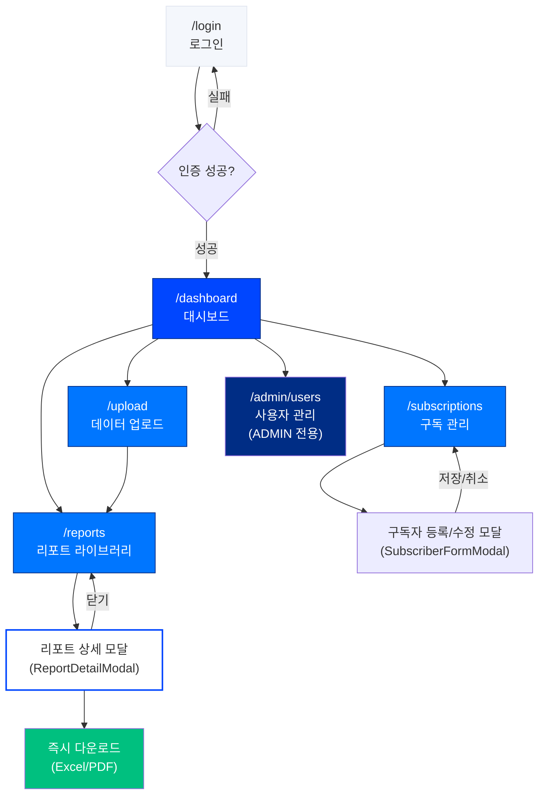
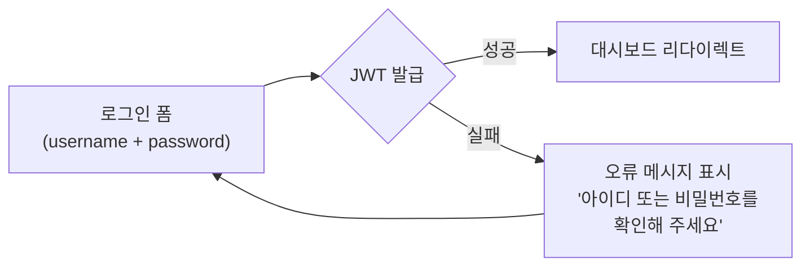
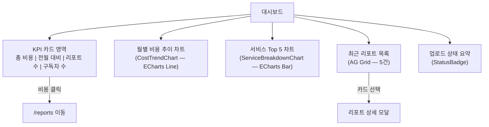
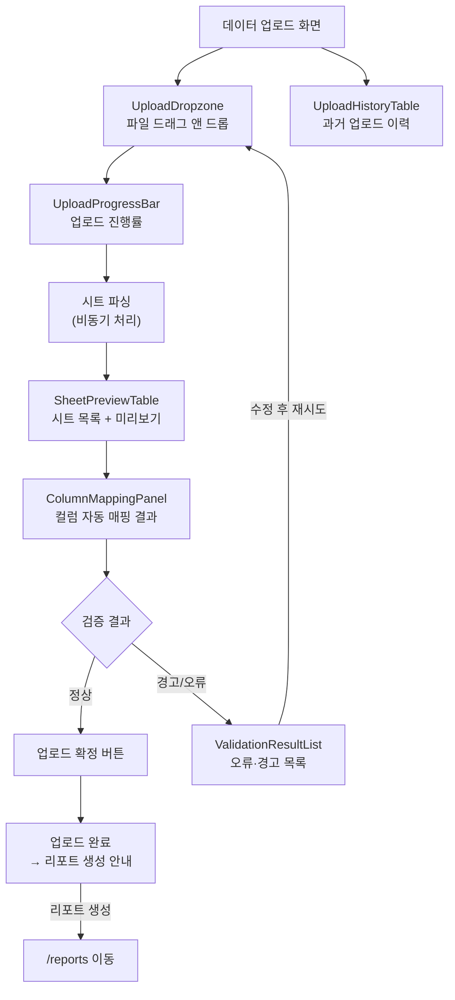
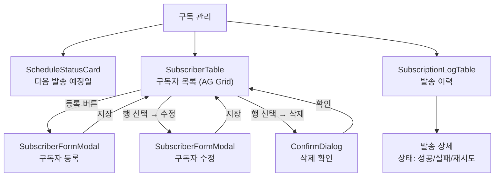
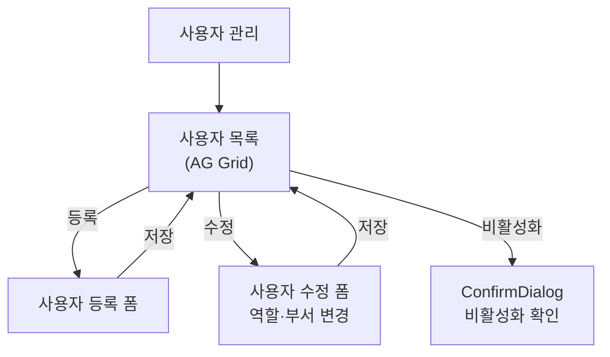
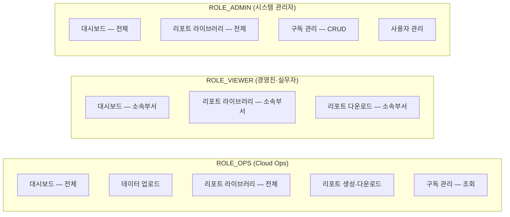

# 화면 흐름도 — 클라우드 비용 리포팅 자동화

> **버전**: v1.0  
> **작성일**: 2026-04-06  
> **작성자**: 01-architect  
> **근거 문서**: docs/brd.md, docs/trd.md (§2.4 레이아웃 구조)

---

## 1. 전체 레이아웃 구조

```
┌──────────────────────────────────────────────────────────────────────┐
│ GNB 1행(56px): CLOUD COST REPORTING   [🔍 메뉴 검색...]   🔔 ⚙ 사용자 │
├──────────────────────────────────────────────────────────────────────┤
│ GNB 2행(48px): 대시보드 | 데이터 업로드 | 리포트 라이브러리 | 구독 관리    │
├──────────────────────────────────────────────────────────────────────┤
│                                                                      │
│  콘텐츠 영역 (배경: #F4F7FC, padding: 24px, max-width: 1400px)        │
│                                                                      │
│  ┌─────────────────────────────────────────────────────────────┐     │
│  │  각 화면별 컨텐츠                                            │     │
│  │                                                             │     │
│  └─────────────────────────────────────────────────────────────┘     │
│                                                                      │
└──────────────────────────────────────────────────────────────────────┘
```

- GNB: `position: sticky; top: 0; z-index: 100`
- 콘텐츠: `flex: 1; overflow-y: auto`
- 사이드바 없음

---

## 2. 메인 네비게이션 흐름



---

## 3. 화면별 상세 흐름

### 3.1 로그인 (`/login`)



- 공개 접근 — 인증 불필요
- JWT 토큰 → localStorage 저장
- 만료 시 자동 로그인 화면 리다이렉트

### 3.2 대시보드 (`/dashboard`)



- 접근: OPS(전체), VIEWER(소속부서), ADMIN(전체)
- KPI 카드: 실시간 집계 데이터 표시
- VIEWER: 소속 부서 데이터만 필터링 표시

### 3.3 데이터 업로드 (`/upload`)



- 접근: OPS만
- 비동기 처리 — 타임아웃 없음
- Alias 사전으로 컬럼 자동 인식

### 3.4 리포트 라이브러리 (`/reports`)

```mermaid
flowchart TD
    LIB["리포트 라이브러리"]
    LIB --> FILTER["FilterBar\n유형 | 주기 | 부서 | 검색"]
    FILTER --> GRID["ReportCardGrid\n카드 목록 표시"]
    GRID --> CARD["ReportCard 선택"]
    CARD --> MODAL["ReportDetailModal\n리포트 상세 팝업"]
    MODAL --> PREVIEW["미리보기\nAG Grid + ECharts"]
    MODAL --> CONFIG["MonthSelector + FormatSelector\n월·형식 설정"]
    CONFIG --> GEN{리포트 존재?}
    GEN -->|있음| DL["DownloadButton\n즉시 다운로드"]
    GEN -->|없음| CREATE["리포트 생성 요청\n(비동기)"]
    CREATE --> PROG["GenerationProgressIndicator"]
    PROG --> DL
    DL --> LOG["다운로드 이력 기록\n(서버 로그)"]
    MODAL -->|닫기 (X / ESC)| LIB

    FILTER --> EMPTY["EmptyState\n검색 결과가 없어요"]
```

- 접근: OPS(전체), VIEWER(소속부서), ADMIN(전체)
- 카드 → 모달 → 다운로드 팝업 내 완결

### 3.5 구독 관리 (`/subscriptions`)



- 접근: OPS(조회만), ADMIN(CRUD)
- 발송 이력: 날짜 필터, 상태 필터 지원

### 3.6 사용자 관리 (`/admin/users`)



- 접근: ADMIN만
- 사용자 삭제 대신 비활성화 (is_active = false)

---

## 4. 역할별 접근 가능 화면



---

## 5. 모달 흐름 정리

| 모달 | 트리거 | 닫기 | 부모 화면 |
|------|--------|------|----------|
| ReportDetailModal | ReportCard 선택 | X 버튼 / ESC / 오버레이 | /reports |
| SubscriberFormModal | 등록/수정 버튼 | 저장 / 취소 | /subscriptions |
| ConfirmDialog | 삭제/비활성화 | 확인 / 취소 | 전체 |

---

## 6. 라우팅 정리

| 경로 | 화면 | 인증 | 역할 제한 |
|------|------|------|----------|
| `/login` | 로그인 | ❌ | - |
| `/dashboard` | 대시보드 | ✅ | OPS, VIEWER, ADMIN |
| `/upload` | 데이터 업로드 | ✅ | OPS |
| `/reports` | 리포트 라이브러리 | ✅ | OPS, VIEWER, ADMIN |
| `/subscriptions` | 구독 관리 | ✅ | OPS(조회), ADMIN(CRUD) |
| `/admin/users` | 사용자 관리 | ✅ | ADMIN |

- 미인증 접근 시 `/login`으로 리다이렉트
- 권한 부족 시 403 화면 표시

---

*본 문서는 TRD v1.1 §2.4 레이아웃 구조 및 BRD v1.0 기능 요구사항 기반으로 작성되었습니다.*
