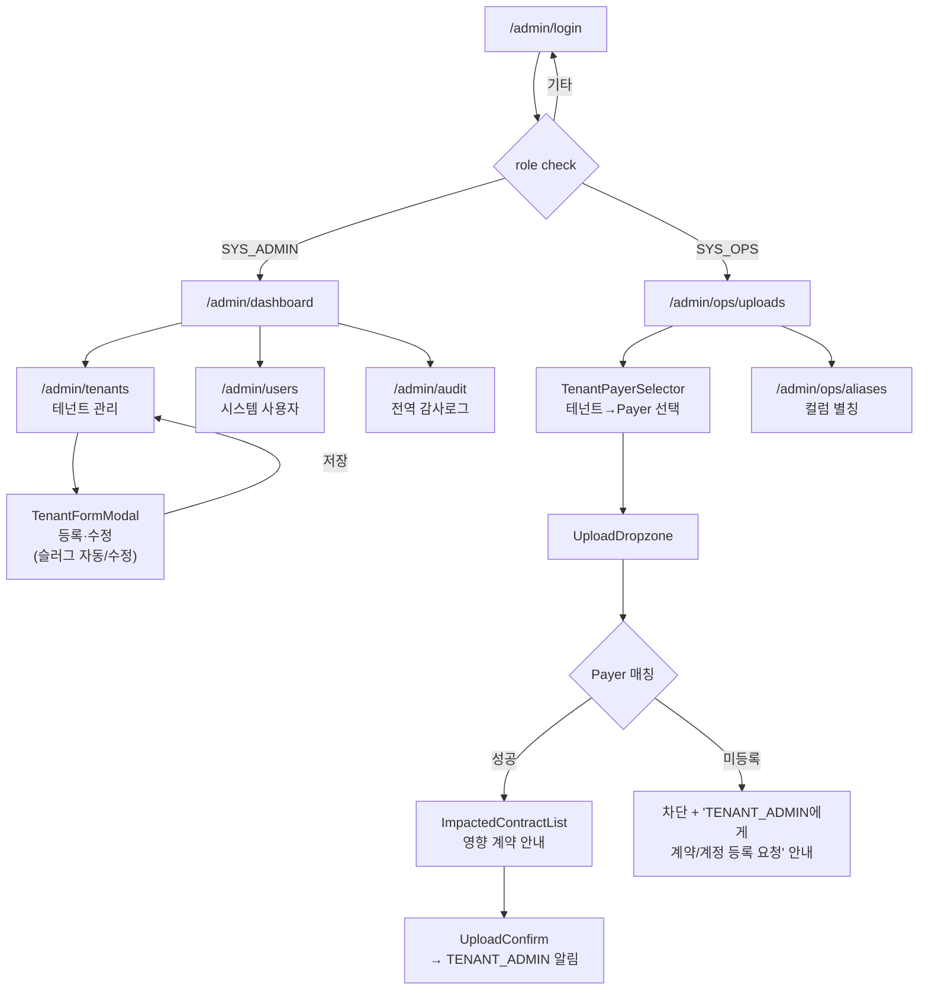
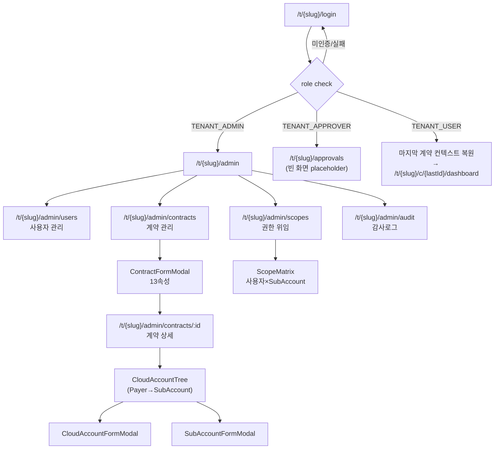
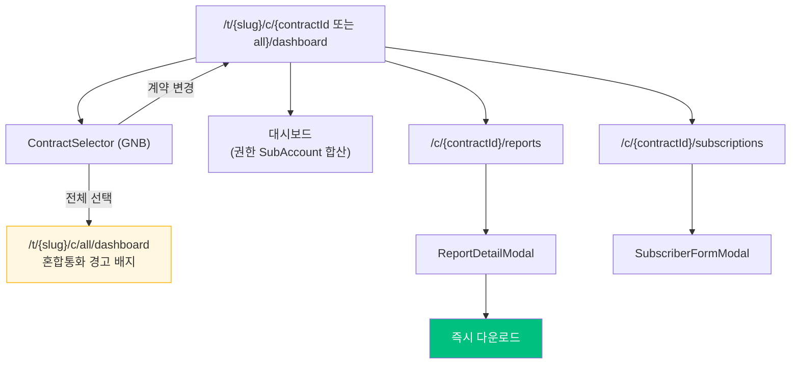
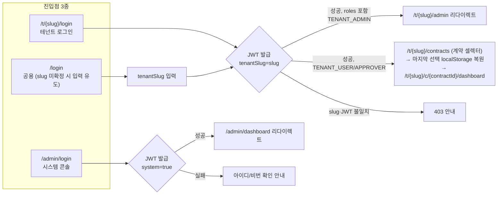
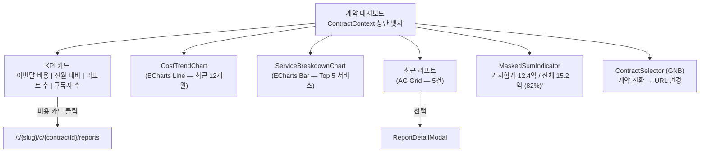
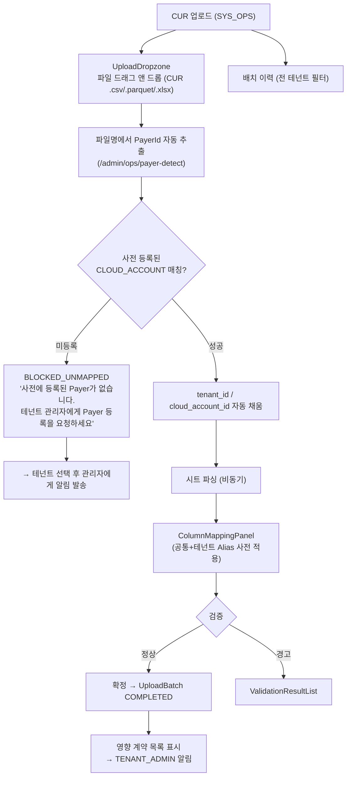
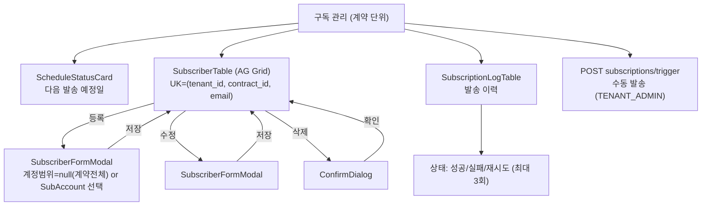
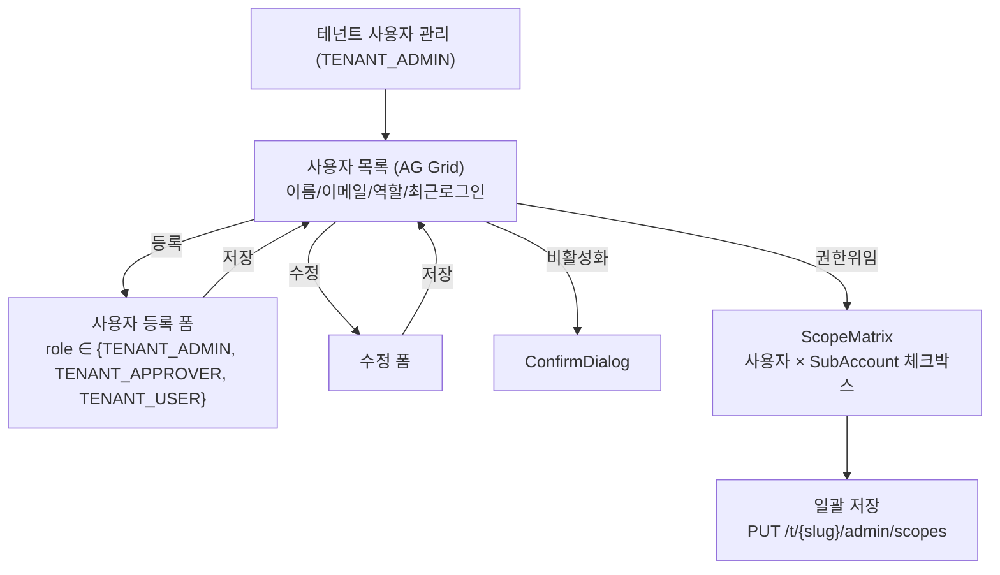

# 화면 흐름도 — 클라우드 비용 리포팅 자동화

> **버전**: v3.0 (DQA-v2-002 반영 — §3 화면별 흐름·§4 역할별 접근도를 v2.0 경로·5권한 체계로 재작성)
> **작성일**: 2026-04-16
> **작성자**: 01-architect
> **근거 문서**: docs/brd.md, docs/trd.md (§2.4 레이아웃 구조), design/api-spec.md v3.0, qa/design/design-qa-report.md v3.0

---

## 0. v3.0 변경 요약 (DQA-v2-002 반영)

| DQA ID | 해소 내용 |
|--------|-----------|
| **DQA-v2-002** High | §3.1~§3.6 화면별 흐름도의 v1 경로(`/login`, `/dashboard`, `/upload`, `/reports`, `/subscriptions`, `/admin/users`)를 v2.0 경로로 교체, 접근 역할을 5권한 체계로 재표기. §4 역할별 접근 subgraph를 SYS_ADMIN/SYS_OPS/TENANT_ADMIN/TENANT_APPROVER/TENANT_USER 5트랙으로 재작성 |

### v2.0 기반 (REG-002 — 유지)

- **라우팅 3분할**: `/admin/*` (시스템 콘솔) / `/t/{slug}/admin/*` (테넌트 콘솔) / `/t/{slug}/c/{contractId}/*` (테넌트 사용자)
- **로그인 분리**: `/admin/login`, `/t/{slug}/login` (세션 만료 시 출발 컨텍스트로 자동 복귀)
- **GNB 변형**: 시스템(파란 배경) / 테넌트(테넌트명+계약 셀렉터) / 미선택(전체 합산 모드)
- **계약 컨텍스트**: 모든 사용자 화면은 `/c/{contractId}` 또는 `/c/all` 하위에 위치, GNB의 ContractSelector로 전환

---

## 1. 전체 레이아웃 구조 (3가지 GNB 변형)

### 1-A. 시스템 콘솔 GNB (`/admin/*`)
```
┌──────────────────────────────────────────────────────────────────────┐
│ [SYSTEM] CLOUD COST REPORTING (배경 #002D85)        🔔 ⚙ 시스템관리자 │
├──────────────────────────────────────────────────────────────────────┤
│ 대시보드 | 테넌트 관리 | 시스템 사용자 | 감사로그 | (SYS_OPS: CUR 업로드) │
├──────────────────────────────────────────────────────────────────────┤
```

### 1-B. 테넌트 콘솔 GNB (`/t/{slug}/admin/*`)
```
┌──────────────────────────────────────────────────────────────────────┐
│ CLOUD COST REPORTING        [신한카드 ▾]            🔔 ⚙ 테넌트관리자 │
├──────────────────────────────────────────────────────────────────────┤
│ 관리자 대시보드 | 사용자 | 계약 | 권한 위임 | 감사로그                 │
├──────────────────────────────────────────────────────────────────────┤
```

### 1-C. 테넌트 사용자 GNB (`/t/{slug}/c/{contractId}/*`)
```
┌──────────────────────────────────────────────────────────────────────┐
│ CLOUD COST REPORTING   [신한카드 ▾]                    🔔 사용자명 ▾  │
├──────────────────────────────────────────────────────────────────────┤
│ [계약: SHC-2026-001 ▾] | 대시보드 | 리포트 | 구독 | (승인자: 승인함)   │
├──────────────────────────────────────────────────────────────────────┤
│                                                                      │
│  콘텐츠 영역 (배경: #F4F7FC, padding: 24px, max-width: 1400px)        │
│                                                                      │
│  ┌─────────────────────────────────────────────────────────────┐     │
│  │  각 화면별 컨텐츠                                            │     │
│  │                                                             │     │
│  └─────────────────────────────────────────────────────────────┘     │
│                                                                      │
└──────────────────────────────────────────────────────────────────────┘
```

- GNB: `position: sticky; top: 0; z-index: 100`
- 콘텐츠: `flex: 1; overflow-y: auto`
- 사이드바 없음

---

## 2. 메인 네비게이션 흐름 (v2.0 — 3트랙)

### 2-A. 시스템 콘솔 흐름



### 2-B. 테넌트 콘솔 흐름 (TENANT_ADMIN)



### 2-C. 테넌트 사용자 흐름 (계약 컨텍스트)



---

## 3. 화면별 상세 흐름 (v3.0 — v2.0 경로로 전환)

### 3.1 로그인 — 3개 진입점 분리



- JWT 토큰은 localStorage 저장(액세스 30분, 리프레시 7일)
- URL `{slug}` ↔ JWT `tenantSlug` 불일치 시 403
- TENANT_USER 권한 보유 계약 0개: "권한받은 계약이 없습니다" 빈 화면 + 테넌트 관리자 문의 안내
- 권한 보유 계약 1개: 자동 진입 / 2개 이상: 셀렉터 + 마지막 선택 복원

### 3.2 대시보드 (`/t/{slug}/c/{contractId}/dashboard`)



- 접근: TENANT_USER (권한 SubAccount만 합산), TENANT_ADMIN (전체), TENANT_APPROVER (조회가능)
- `contractId=all` 가상 컨텍스트: 권한 보유 계약 전부 합산 + MixedCurrencyBadge
- 통화 혼합 경고: USD·KRW 계약이 섞여있으면 상단에 "통화가 달라 합산 표시가 정확하지 않을 수 있어요" 노란 배너
- RLS + TenantUserScope 자동 필터링 — 권한 없는 SubAccount는 집계에서 자동 제거

### 3.3 CUR 업로드 — 시스템 운영자 전용 (`/admin/ops/uploads`)



- 접근: SYS_OPS (RLS bypass, 모든 쓰기는 AUDIT_LOG 기록)
- Payer 매칭 실패 시 업로드 **차단** — 데이터 누수 방지 (F11 비즈니스 규칙)
- 배치 상태 흐름: PENDING → PROCESSING → (COMPLETED | ERROR | BLOCKED_UNMAPPED)
- 테넌트 관리자 알림: 이메일 + 테넌트 대시보드 배너

### 3.4 리포트 라이브러리 (`/t/{slug}/c/{contractId}/reports`)

```mermaid
flowchart TD
    LIB["리포트 라이브러리 (계약 단위)"]
    LIB --> FILTER["FilterBar\n템플릿 | 연월 | 검색"]
    FILTER --> GRID["ReportCardGrid"]
    GRID --> CARD["ReportCard 선택 (RoleTemplateMatrix 필터링)"]
    CARD --> MODAL["ReportDetailModal"]
    MODAL --> PREVIEW["미리보기 (AG Grid + ECharts)"]
    MODAL --> CONFIG["MonthSelector + FormatSelector"]
    CONFIG --> GEN{리포트 존재?}
    GEN -->|있음| DL["DownloadButton"]
    GEN -->|없음 AND TENANT_ADMIN| CREATE["POST reports/generate"]
    GEN -->|없음 AND TENANT_USER| ASK["생성 요청 안내\n(관리자에게 요청)"]
    CREATE --> PROG["GenerationProgressIndicator"]
    PROG --> DL
    DL --> LOG["DOWNLOAD_LOG 서버 기록 (tenant_id 포함)"]
    MODAL -->|닫기 (X / ESC)| LIB
    FILTER --> EMPTY["EmptyState"]
```

- 접근: TENANT_USER (권한 SubAccount에 해당하는 리포트만), TENANT_ADMIN (계약 전체 + 생성 가능)
- 템플릿 가시성은 상수 `RoleTemplateMatrix`로 제한 (R01~R06 × 5개 역할)
- 리포트는 `(tenant_id, contract_id, target_year_month)` 단위로 생성·조회

### 3.5 구독 관리 (`/t/{slug}/c/{contractId}/subscribers`)



- 접근: TENANT_USER (조회), TENANT_ADMIN (CRUD + 수동 발송)
- 구독자 계정범위(account_scope)는 NULL이면 계약 전체, 아니면 JSON 배열로 SubAccount 지정

### 3.6 테넌트 사용자 관리 (`/t/{slug}/admin/users`)



- 접근: TENANT_ADMIN (자기 테넌트 사용자만) — RLS로 다른 테넌트 조회 불가
- 시스템 사용자(SYS_ADMIN/SYS_OPS) 등록은 `/admin/users`에서 별도 처리
- Scope 저장 시 SubAccount 전원 선택 = 계약 전체 권한으로 자동 요약 표기

---

## 4. 역할별 접근 가능 화면 (v3.0 — 5권한)

```mermaid
flowchart LR
    subgraph SYS_ADMIN["ROLE_SYS_ADMIN"]
        S1[/admin/dashboard]
        S2[/admin/tenants — 테넌트 CRUD]
        S3[/admin/users — 시스템 사용자]
        S4[/admin/audit-logs — 전역]
    end

    subgraph SYS_OPS["ROLE_SYS_OPS"]
        O1[/admin/ops/uploads — CUR 업로드]
        O2[/admin/ops/aliases — 컬럼 별칭]
        O3[/admin/ops/payer-detect]
    end

    subgraph T_ADMIN["ROLE_TENANT_ADMIN"]
        TA1[/t/{slug}/admin — 홈]
        TA2[/t/{slug}/admin/contracts — 계약]
        TA3[/t/{slug}/admin/cloud-accounts — Payer/Sub]
        TA4[/t/{slug}/admin/users — 사용자]
        TA5[/t/{slug}/admin/scopes — 권한 위임]
        TA6[/t/{slug}/admin/audit-logs — 테넌트]
        TA7[/t/{slug}/c/*/reports/generate — 생성]
    end

    subgraph T_APPROVER["ROLE_TENANT_APPROVER"]
        AP1[/t/{slug}/approvals — 승인함 placeholder]
        AP2[/t/{slug}/c/{contractId}/dashboard — 조회]
    end

    subgraph T_USER["ROLE_TENANT_USER"]
        U1[/t/{slug}/contracts — 셀렉터]
        U2[/t/{slug}/c/{contractId}/dashboard]
        U3[/t/{slug}/c/{contractId}/reports]
        U4[/t/{slug}/c/{contractId}/subscribers]
    end
```

| 역할 | 데이터 범위 | 특이사항 |
|------|-----------|----------|
| SYS_ADMIN | 전 테넌트 | RLS bypass, 쓰기는 AUDIT_LOG |
| SYS_OPS | 전 테넌트 (업로드/매핑만) | 환경설정·테넌트 CRUD 불가 |
| TENANT_ADMIN | 자기 테넌트 + 모든 계약·SubAccount | 사용자·계약·권한 관리 |
| TENANT_APPROVER | 자기 테넌트 + 권한 SubAccount (조회) | 승인 placeholder (향후 티켓) |
| TENANT_USER | 권한 부여된 SubAccount 범위 | 리포트 생성 불가(조회·다운로드만) |

---

## 5. 모달 흐름 정리

| 모달 | 트리거 | 닫기 | 부모 화면 |
|------|--------|------|----------|
| ReportDetailModal | ReportCard 선택 | X 버튼 / ESC / 오버레이 | `/t/{slug}/c/{contractId}/reports` |
| SubscriberFormModal | 등록/수정 버튼 | 저장 / 취소 | `/t/{slug}/c/{contractId}/subscribers` |
| TenantFormModal | 테넌트 등록/수정 | 저장 / 취소 | `/admin/tenants` |
| ContractFormModal | 계약 등록/수정 | 저장 / 취소 | `/t/{slug}/admin/contracts` |
| ScopeMatrix | 사용자 상세 → 권한 위임 | 저장 / 취소 | `/t/{slug}/admin/users/:id` |
| ConfirmDialog | 삭제/비활성화 | 확인 / 취소 | 전체 |

---

## 6. 라우팅 정리 (v2.0 전체)

### 6.1 시스템 콘솔
| 경로 | 화면 | 인증 | 역할 |
|------|------|------|----------|
| `/admin/login` | 시스템 로그인 | ❌ | 공개 |
| `/admin/dashboard` | 시스템 대시보드 | ✅ | SYS_ADMIN |
| `/admin/tenants`, `/admin/tenants/:id` | 테넌트 관리 | ✅ | SYS_ADMIN |
| `/admin/users` | 시스템 사용자 관리 | ✅ | SYS_ADMIN |
| `/admin/audit` | 전역 감사로그 | ✅ | SYS_ADMIN |
| `/admin/ops/uploads` | CUR 업로드 | ✅ | SYS_OPS |
| `/admin/ops/aliases` | 컬럼 별칭 | ✅ | SYS_OPS |

### 6.2 테넌트 콘솔
| 경로 | 화면 | 인증 | 역할 |
|------|------|------|----------|
| `/t/{slug}/login` | 테넌트 로그인 | ❌ | 공개 |
| `/t/{slug}/admin` | 테넌트 관리자 대시보드 | ✅ | TENANT_ADMIN |
| `/t/{slug}/admin/users` | 테넌트 사용자 | ✅ | TENANT_ADMIN |
| `/t/{slug}/admin/contracts`, `/:id` | 계약 관리 | ✅ | TENANT_ADMIN |
| `/t/{slug}/admin/scopes` | 권한 위임 | ✅ | TENANT_ADMIN |
| `/t/{slug}/admin/audit` | 테넌트 감사로그 | ✅ | TENANT_ADMIN |

### 6.3 테넌트 사용자
| 경로 | 화면 | 인증 | 역할 |
|------|------|------|----------|
| `/t/{slug}/c/{contractId}/dashboard` | 계약별 대시보드 | ✅ | TENANT_* |
| `/t/{slug}/c/all/dashboard` | 전체 합산 대시보드 | ✅ | TENANT_* (2개 이상 권한 시) |
| `/t/{slug}/c/{contractId}/reports` | 리포트 라이브러리 | ✅ | TENANT_* |
| `/t/{slug}/c/{contractId}/subscriptions` | 구독 관리 | ✅ | TENANT_ADMIN(CRUD) / TENANT_USER(자기 것) |
| `/t/{slug}/approvals` | 승인함 (placeholder) | ✅ | TENANT_APPROVER |

### 6.4 라우팅·세션 규칙
- 미인증 접근 시 출발 컨텍스트 기반 로그인으로 리다이렉트:
  - `/admin/*` → `/admin/login`
  - `/t/{slug}/*` → `/t/{slug}/login`
  - 슬러그 없는 진입 → `/login` (테넌트 슬러그 입력 화면)
- 권한 부족 시 403 화면
- 세션 만료(JWT) 시 출발 컨텍스트 기반 로그인 재이동, 만료 직전 자동 갱신(refresh) 시도
- 테넌트 사용자 진입 시 마지막 선택 계약(`localStorage`) 복원, 없으면 권한 보유 첫 계약

---

*본 문서는 TRD v1.1 §2.4 레이아웃 구조, BRD v1.0 기능 요구사항, REG-002 멀티테넌트 요건(OPEN-009~017), DQA-v2-002 회귀 지시를 반영한 v3.0입니다.*
